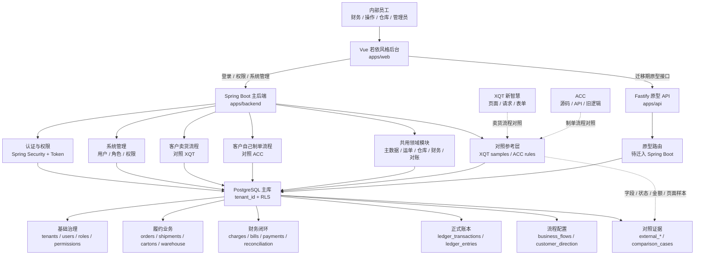
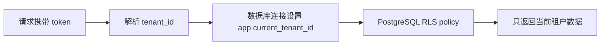
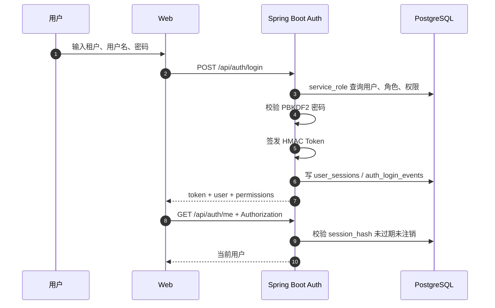
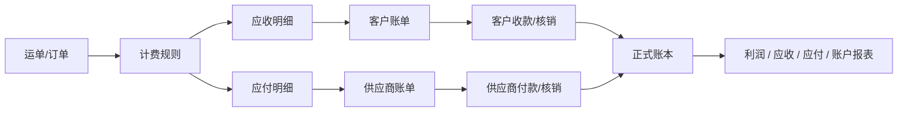
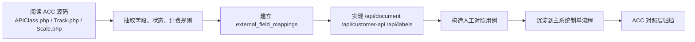
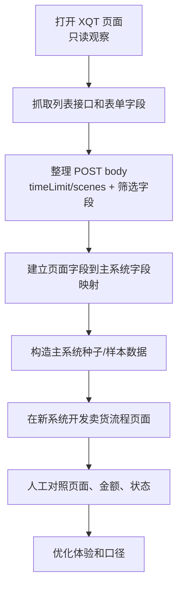

# 新航线统一平台完整系统架构与开发文档

版本：2026-05-07  
适用阶段：MVP / 从零开发卖货客户与制单客户两套流程  
技术主线：Java 17 + Spring Boot 3.5.x + PostgreSQL + Vue 若依风格后台

## 1. 项目定位

新航线统一平台不是 ACC 或新智慧的套壳，也不是长期依赖旧系统的中间层。平台目标是从零建立新的主业务系统，统一承载两套客户流程：**客户卖货流程**和**客户自己制单流程**。两套流程共用租户、权限、客户、服务、订单、运单、费用、账单、核销、账本和审计底座，但入口、页面、API、财务口径和验收样本分开设计。

| 旧系统 | 当前条件 | 新系统中的作用 | 长期关系 |
| --- | --- | --- | --- |
| 新智慧 XQT | 无源码，有页面和只读请求样本 | 作为客户卖货流程的页面、筛选、财务、仓配和账单对照样本 | 只做参考，不作为运行依赖 |
| ACC | 有源码，当前真实数据库未接通 | 作为客户自己制单流程的 API 下单、面单、轨迹、余额和费用对照样本 | 只做参考，不作为运行依赖 |
| 新航线统一平台 | 已有主库、Spring Boot 后端、Vue 前端 | 新业务事实来源和统一操作入口 | 唯一目标主系统 |

客户方向口径：

| 客户流程 | 建议编码 | 对照来源 | 核心诉求 |
| --- | --- | --- |
| 客户卖货流程 | `SELLER_CUSTOMER` | XQT | 货品、订单、仓库、发货、账单、利润、售后、POD、客户对账 |
| 客户自己制单流程 | `DOCUMENT_CUSTOMER` | ACC | 制单、取号、面单、轨迹、运费试算、余额、API 下单、批量导入 |

核心口径：

1. 新业务以主系统 PostgreSQL 主库为准。
2. 不再以“复刻 XQT/ACC”为目标；目标是从零设计两套新流程。
3. XQT 只对照客户卖货流程，ACC 只对照客户自己制单流程。
4. 主系统用 `customer_direction` 区分两套流程，用 `source_system` / `external_*` 记录对照来源。
5. 没有历史数据接入时，通过页面、接口、表单、金额、状态的人工对照验证新流程口径。
6. MVP 采用模块化单体，不在三人三周阶段拆微服务。

### 1.1 两套流程边界

| 维度 | 客户卖货流程，对照 XQT | 客户自己制单流程，对照 ACC |
| --- | --- | --- |
| 业务入口 | 销售订单、仓库收货、发货计划、后台建单 | 客户 API 下单、批量导入、快速制单、客户门户 |
| 核心对象 | 商品、订单、仓库、出货、客户账单、供应商账单、利润 | 运单、包裹、面单、轨迹、余额、预扣费、客户账单 |
| 前端重点 | 工作台、订单、仓配、财务、售后、利润报表 | 制单台、查价、标签、轨迹、余额、API 凭证 |
| API 重点 | `/api/seller/*`, `/api/warehouse/*`, `/api/finance/*` | `/api/document/*`, `/api/customer-api/*`, `/api/labels/*`, `/api/tracking/*` |
| 财务口径 | 应收、应付、利润、提成、月结、供应商对账 | 余额、充值、预扣费、运费、面单费用、制单账单 |
| 对照材料 | XQT 页面、只读列表接口、财务请求 body | ACC 源码、旧 API body、状态码、费用和面单逻辑 |
| 生产依赖 | 只依赖主系统数据库 | 只依赖主系统数据库 |

## 2. 当前实现状态

| 层级 | 技术 | 当前路径 | 状态 |
| --- | --- | --- | --- |
| 前端 | Vue 3 + Vite + lucide 图标 | `apps/web` | 已调整为若依风格后台壳 |
| 主后端 | Java 17 + Spring Boot 3.5.x | `apps/backend` | 已实现认证、会话、权限、基础管理 API |
| 原型 API | Fastify + TypeScript | `apps/api` | 早期原型路由，后续迁入 Spring Boot |
| 数据库 | PostgreSQL + RLS | `db/migrations`, `db/seeds` | 已有租户、权限、业务、财务、外部映射基础表 |
| 文档 | Markdown + Mermaid + SVG/PDF | `docs` | 已有架构、数据库、API、流程图、抓取结果 |

当前本地运行约定：

| 服务 | 默认地址 | 说明 |
| --- | --- | --- |
| Web | `http://localhost:5173` | 统一前端入口 |
| Spring Boot API | `http://localhost:18103` | 主后端，登录、权限、系统管理 |
| Fastify API | `http://localhost:18080` | 原型接口，迁移期按需保留 |
| PostgreSQL | `localhost:5432` 或 Docker `15432` | 主业务数据库 |

前端代理：

| 前端请求 | 代理目标 | 说明 |
| --- | --- | --- |
| `/api/auth/*` | Spring Boot | 登录、登出、当前用户 |
| `/api/admin/*` | Spring Boot | 用户、角色、权限 |
| `/api/health` | Spring Boot | 主后端健康检查 |
| `/api/*` | Fastify | 当前业务原型 |
| `/health` | Fastify | 原型 API 状态 |

## 3. 总体架构



架构原则：

| 原则 | 要求 |
| --- | --- |
| 主系统优先 | 新业务写入主库，外部系统不再作为事实来源 |
| 模块化单体 | Spring Boot 内按包隔离模块，避免过早拆微服务 |
| 租户隔离 | 业务表带 `tenant_id`，数据库启用 RLS |
| 对照样本隔离 | ACC/XQT 字段进入 `external_*`，不直接污染核心表 |
| 可对照 | 页面、接口、字段、金额、状态都有对照用例 |
| 可替换 | 原型 Fastify 和外部对照层完成迁移后逐步归档 |

### 3.1 软件工程标准图集

为便于评审和放入腾讯文档，架构图已经按软件工程常用定义渲染为白底 PNG/SVG。完整图集见 `docs/software-engineering-diagrams.md`。

| 图 | 定义 | 图片 |
| --- | --- | --- |
| C4-L1 系统上下文图 | 系统边界、用户、外部系统 | `docs/assets/engineering/01-c4-system-context.png` |
| C4-L2 容器图 | Web、后端、数据库、缓存、外部系统容器关系 | `docs/assets/engineering/02-c4-container.png` |
| C4-L3 组件图 | Spring Boot 内部组件职责 | `docs/assets/engineering/03-spring-component.png` |
| 领域模块依赖图 | 业务模块边界和依赖方向 | `docs/assets/engineering/04-module-dependency.png` |
| 核心数据模型 ERD | 认证、订单、财务、外部映射实体关系 | `docs/assets/engineering/05-data-model-erd.png` |
| RBAC 权限图 | token、session、permission、RLS 校验链路 | `docs/assets/engineering/06-rbac-permission.png` |
| 登录时序图 | 登录、会话、审计流程 | `docs/assets/engineering/07-auth-sequence.png` |
| API 生命周期时序图 | 鉴权、校验、幂等、RLS、审计链路 | `docs/assets/engineering/08-api-lifecycle-sequence.png` |
| 财务状态机 | 费用从草稿到过账、冲正的生命周期 | `docs/assets/engineering/09-finance-state.png` |
| XQT 卖货对照活动图 | 只读抓取、字段映射、页面对照、人工验收 | `docs/assets/engineering/10-xqt-clone-activity.png` |
| ACC 制单对照流程图 | 源码反推、API 对照、差异测试、领域沉淀 | `docs/assets/engineering/11-acc-migration-flow.png` |
| 生产部署拓扑图 | 生产网络、应用、数据、备份、外部边界 | `docs/assets/engineering/12-deployment-topology.png` |
| CI/CD 质量门禁图 | 开发到发布的测试和质量门禁 | `docs/assets/engineering/13-ci-cd-quality.png` |

### 3.2 客户方向模型

客户方向模型见 `docs/customer-direction-model.md`。后续菜单、权限、API、测试用例都应同时包含：

| 维度 | 说明 |
| --- | --- |
| `customer_direction` | `SELLER_CUSTOMER` / `DOCUMENT_CUSTOMER` / `BOTH` |
| `source_system` | ACC / XQT / LOCAL |
| `service_mode` | 卖货履约、制单发货、仓配、转运等 |
| `external_object_refs` | 旧系统客户 ID、单号、对象引用 |

## 4. 代码结构

当前主目录：

```text
xqt-saas/
  apps/
    web/       Vue 若依风格后台
    backend/   Spring Boot 主后端
    api/       Fastify 原型 API
  db/
    migrations/
    seeds/
  docs/
  infra/
```

Spring Boot 目标包结构：

```text
com.xqt.saas
  auth              登录、会话、Token、权限过滤
  admin             用户、角色、权限、菜单、配置
  common            统一响应、异常、分页、校验
  health            健康检查
  module
    masterdata      客户、供应商、服务、线路、币种、费用类型
    order           订单、客户下单、预报
    shipment        运单、轨迹、异常、审计状态
    warehouse       入库、出库、装箱、托盘、库存
    finance         应收、应付、账户、发票、账单、费用审批
    reconciliation  对账、差异、核销
    ledger          正式账本、凭证、分录
    external        外部系统、字段映射、对照用例
  reference
    acc             ACC 源码和旧 API 对照层
    xqt             XQT 页面/API 样本对照层
  flow
    seller          客户卖货流程
    document        客户自己制单流程
  infrastructure
    tenant          tenant context / RLS 设置
    audit           操作日志、审计事件
    redis           缓存、锁、任务状态
    db              JDBC、事务、通用查询
  job               导入、对账、轨迹同步、重试任务
```

Fastify 原型迁移原则：

1. `/api/auth/*`、`/api/admin/*` 已由 Spring Boot 接管。
2. `/api/finance/*` 是第一批迁移目标。
3. `/api/acc/*` 不作为目标生产接口，只作为制单流程对照材料，最终沉淀为 `/api/document/*` 和 `/api/customer-api/*`。
4. `/api/sys/*` 后续迁入 Spring Boot `admin` 模块。

## 5. 前端架构

前端目标是若依风格后台操作体验，但不直接照搬若依完整工程。

页面骨架：

| 区域 | 说明 |
| --- | --- |
| 登录页 | 租户、用户名、密码 |
| 左侧菜单 | 卖货流程、制单流程、财务中心、系统治理、对照中心 |
| 顶部栏 | 折叠菜单、面包屑、消息、全屏、设置、用户信息 |
| 页签栏 | 类若依 tag-view，可切换和关闭页面 |
| 内容区 | 卖货工作台、制单工作台、订单/运单、仓库、财务、系统管理、对照中心 |
| 表格工具区 | 查询、重置、新增、审核、导出、批量动作 |

设计要求：

1. 后台系统以表格、筛选、批量操作、状态标签为核心。
2. 财务页面优先展示金额、币种、核销、开票、审核、账单关系。
3. 卖货流程页面以 XQT 为对照，先做到字段、筛选、列表、状态口径可验证，再做体验优化。
4. 制单流程页面以 ACC 为对照，保留必要的旧字段引用，最终以新系统字段和页面为准。
5. 危险操作必须二次确认，并进入操作日志。

## 6. 数据库架构

数据库采用 PostgreSQL。核心业务表必须包含：

| 字段 | 说明 |
| --- | --- |
| `id` | 主键，优先 UUID 或系统内部 bigint |
| `tenant_id` | 租户隔离字段 |
| `created_at` / `updated_at` | 创建、更新时间 |
| `created_by` / `updated_by` | 操作人 |
| `deleted_at` | 软删除，必要时使用 |

已落地迁移：

| 文件 | 作用 |
| --- | --- |
| `001_init.sql` | 初始租户和基础数据结构 |
| `002_rls.sql` | RLS 租户隔离 |
| `003_ledger.sql` | 账本基础 |
| `004_jobs_idempotency.sql` | 任务与幂等 |
| `005_authorization.sql` | 用户、角色、权限 |
| `006_full_painpoint_modules.sql` | 痛点模块 |
| `007_organizations_and_extensions.sql` | 组织和扩展 |
| `008_main_master_data.sql` | 主数据 |
| `009_orders_warehouse.sql` | 订单和仓库 |
| `010_finance_clone_core.sql` | 财务核心表 |
| `011_external_mapping.sql` | 外部系统映射和对照 |
| `012_auth_foundation.sql` | 登录会话和审计 |
| `013_greenfield_two_flows.sql` | 从零开发两套客户流程 |

数据分层：

| 层级 | 表/模块 | 说明 |
| --- | --- | --- |
| 治理层 | `tenants`, `users`, `roles`, `permissions` | 租户、账号、权限 |
| 组织层 | organizations, branches, departments | 分公司、部门、人员组织 |
| 主数据层 | customers, partners, services, currencies, charge_types | 客户、供应商、服务、费用、币种 |
| 履约层 | orders, shipments, cartons, warehouse records | 订单、运单、箱、仓库 |
| 财务层 | receivables, payables, invoices, payments, accounts | 应收、应付、账单、账户 |
| 账本层 | `ledger_transactions`, `ledger_entries` | 正式会计分录和账务事实 |
| 流程配置层 | `business_flows`, `customer_direction` | 卖货流程和制单流程 |
| 对照证据层 | `external_systems`, `external_modules`, `external_field_mappings`, `comparison_cases` | ACC/XQT 对照依据 |

租户隔离：



外部映射关键表：

| 表 | 作用 |
| --- | --- |
| `external_systems` | 登记 XQT、ACC 等对照来源 |
| `external_modules` | 登记对照页面、模块、接口、方法 |
| `external_field_mappings` | 外部字段到主系统字段的映射 |
| `external_object_refs` | 主对象和外部 ID/单号引用 |
| `comparison_cases` | 人工对照用例、期望结果、实际结果、差异状态 |

## 7. 认证与权限

认证体系必须服务主系统，不复用 ACC 或新智慧账号。外部系统账号只作为样本或迁移来源，不参与主系统授权判断。

当前 API：

| 方法 | 路径 | 说明 |
| --- | --- | --- |
| `POST` | `/api/auth/login` | 登录，返回 token、用户、角色、权限 |
| `GET` | `/api/auth/me` | 获取当前用户和权限 |
| `POST` | `/api/auth/logout` | 注销当前会话 |
| `GET/POST/PUT/DELETE` | `/api/admin/users` | 用户 CRUD、角色绑定、操作人记录 |
| `GET/POST/PUT/DELETE` | `/api/admin/roles` | 角色 CRUD、权限绑定、操作人记录 |
| `GET` | `/api/admin/permissions` | 权限列表 |
| `GET` | `/api/admin/audit-logs` | 操作审计日志 |
| `GET` | `/api/business-flows` | 两套业务流程配置 |
| `POST/GET/PUT/DELETE` | `/api/seller/orders` | 客户卖货订单 CRUD |
| `POST/GET/PUT/DELETE` | `/api/document/orders` | 客户自己制单订单 CRUD |

登录流程：



权限编码建议：

| 模块 | 示例权限 |
| --- | --- |
| 系统 | `admin.user.read`, `admin.user.write`, `admin.role.write` |
| 订单 | `order.read`, `order.write`, `order.audit` |
| 仓库 | `warehouse.inbound.write`, `warehouse.outbound.write` |
| 财务 | `finance.receivable.read`, `finance.payable.write`, `finance.ledger.post` |
| 对账 | `reconciliation.read`, `reconciliation.resolve` |
| 外部对照 | `external.mapping.read`, `external.compare.write` |

## 8. 领域模块设计

### 8.1 主数据中心

主数据中心负责标准化客户、供应商、服务、线路、币种、费用类型、国家地区、仓库、员工组织。

开发目标：

1. 把 XQT 卖货对照和 ACC 制单对照里的客户、供应商、费用名映射到主系统标准对象。
2. 支持别名、外部 ID、外部编码、历史编码。
3. 为订单、运单、计费、财务模块提供统一引用。

### 8.2 订单、运单与仓库履约

目标能力：

| 能力 | 说明 |
| --- | --- |
| 客户下单 | 客户订单、预报、申报明细、收发件信息 |
| 运单管理 | 运单号、提单号、服务、路线、状态 |
| 箱/货物 | 箱级装箱、重量、体积、件数 |
| 仓库 | 入库、出库、托盘、装箱、库存 |
| 轨迹 | 内部轨迹、外部轨迹、异常事件 |

ACC 中 `Online`、`Express`、`Express_Item`、`Online_Package*` 只作为客户自己制单流程的对照样本，能力沉淀到主系统 `orders`、`shipments`、`declarations`、`cartons`、`tracking_events`。

### 8.3 计费与规则引擎

计费模块要支撑两套流程：客户卖货流程对照 XQT 财务口径，客户自己制单流程对照 ACC 运费、余额和面单费用口径。

核心对象：

| 对象 | 说明 |
| --- | --- |
| rate_cards | 价卡 |
| rate_rules | 计费规则 |
| charge_items | 费用明细 |
| charge_audits | 费用审核 |
| currency_rates | 汇率 |
| billing_snapshots | 计费快照，保证历史可追溯 |

设计要求：

1. 每次计费保留输入、规则版本、输出和操作人。
2. 重算不能覆盖历史结果，必须生成新版本或审计日志。
3. 金额字段使用 `numeric(18,4)`，展示层按币种精度格式化。

### 8.4 财务中心

财务中心是两套流程共用的资金、账单、核销和账本中心；客户卖货流程优先对照 XQT 财务页面，客户自己制单流程优先对照 ACC 费用、余额和账单口径。

P0 页面：

| 页面 | XQT 对照接口 | 新系统目标能力 |
| --- | --- | --- |
| 财务流水 | `/rest/tms/aos/financial_detail/lists` | 资金流水、账户、审核、开票状态 |
| 运单审计 | `/rest/tms/aos/shipment/lists` | 运单应收、应付、利润、审核状态 |
| 客户流水 | `/rest/tms/aos/invoice_detail/lists` | 客户费用明细、核销、账单关联 |
| 客户账单 | `/rest/tms/aos/invoice/lists` | 客户账单、到期、核销、开票 |
| 供应商流水 | `/rest/tms/aos/detail_partner/lists` | 供应商费用明细、核销、账单关联 |
| 供应商账单 | `/rest/tms/aos/invoice_partner/lists` | 供应商账单、到期、核销 |
| 账户 | `/rest/tms/aos/financial_account/lists` | 公司/客户/供应商账户 |
| 账户流水 | `/rest/tms/aos/financial_account_record/lists` | 账户资金变动 |
| 费用审批 | `/rest/tms/aos/charge_approval/lists` | 费用审批流 |

财务闭环：



### 8.5 对账与账本

对账模块解决客户卖货、客户自己制单和主系统财务口径之间的差异。

| 能力 | 说明 |
| --- | --- |
| 对照用例 | 按页面、接口、筛选、字段、金额记录 expected/actual |
| 差异定位 | 字段缺失、金额偏差、状态不一致、排序/分页差异 |
| 账本过账 | 只有确认后的财务事实可过账 |
| 回滚/冲正 | 不删除历史账务，通过冲正分录修正 |

### 8.6 外部对照中心

外部对照中心不是运行时业务依赖，而是样本治理、字段映射和验收工具。

| 来源 | 采集方式 | 输出 |
| --- | --- | --- |
| XQT 页面/API | 页面观察、只读请求抓取 | 卖货流程页面清单、POST body、字段映射、对照用例 |
| ACC 源码/API | 读 PHP 源码、SQL、旧逻辑、旧 API body | 制单流程字段映射、状态机、计费规则、面单和轨迹样本 |

安全要求：

1. XQT 采集阶段只做读取和页面观察。
2. 不点击新增、保存、审核、删除、导入、导出、生成、同步等写入动作。
3. 文档不固化真实账号、密码、token、cookie、第三方真实域名。

## 9. 客户自己制单流程，对照 ACC

客户自己制单流程从零开发，ACC 的源码和 API 只作为对照。ACC 的核心不是单纯“订单表”，而是围绕 `Express` 运单展开，这部分对照重点是 API 下单、运费试算、面单、轨迹、余额和费用。

ACC 关键对象：

| ACC 对象 | 旧含义 | 新系统映射 |
| --- | --- | --- |
| `Online` | API 下单/预报信息 | `orders`, `order_addresses`, `order_declarations` |
| `Express` | 运单主档、产品、国家、状态、计费结果 | `shipments` |
| `Express_Item` | 申报明细 | `declarations` |
| `Online_Package*` | 箱级装箱单 | `cartons`, `carton_items` |
| `Express_Charge` | 运单费用 | `charge_items` |
| `Customer_Balance*` | 客户余额和流水 | `financial_accounts`, `financial_account_records` |
| `Express_Process` / `Transit_Process` / `Stowage_Process` | 轨迹和过程 | `tracking_events` |
| `Product*` / `Channel*` | 产品、渠道、价格 | `services`, `rate_cards`, `rate_rules` |

开发路径：



不要照搬 ACC 旧表结构，也不要把 `/api/acc/*` 作为目标生产接口。旧字段只在 `external_*` 映射层保留，主系统用清晰的制单领域模型承接。

## 10. 客户卖货流程，对照 XQT

客户卖货流程从零开发，XQT 没有源码，只作为页面、筛选、仓配、财务、账单和审批口径对照。对照方式是页面观察 + 只读请求抓取 + 表单字段倒推 + 人工对照。

已确认请求规律：

| 类型 | 规律 |
| --- | --- |
| 列表接口 | `POST /rest/tms/{domain}/{module}/lists` |
| 菜单接口 | `GET /rest/tms/aos/common/menu` |
| 财务基础 body | `{"timeLimit":0,"scenes":1}` |
| 筛选字段 | 作为顶层字段追加到 body |
| 日期范围 | 通常为两个时间组成的数组 |
| 下拉字段 | 取页面配置中的 key/value |

已抓取核心页面：

| 分类 | 页面/接口 |
| --- | --- |
| 客户侧单据 | 运单、提单、工单、快递单、保险单、预约取件、单证、货箱、邮包、轨迹 |
| 用户合同 | 用户、用户等级、合同、结算方式、客户 API 对接 |
| 财务 | 财务流水、运单审计、应收报表、应付报表、运价维护、客户流水、客户账单、供应商流水、供应商账单、账户、汇率、审批 |
| 仓库 | 仓库收货、仓库出货、托盘、打托派送、小包装箱、标签、拣货日志 |
| 系统主数据 | 服务、供应商、线路、区域、仓库、机场港口、API 配置、地址库、规则、员工、组织、模板 |

XQT 对照流程：



## 11. API 架构

当前 API 分组：

| 分组 | 路径 | 当前归属 | 目标归属 |
| --- | --- | --- | --- |
| 健康检查 | `/api/health` | Spring Boot | Spring Boot |
| 认证 | `/api/auth/*` | Spring Boot | Spring Boot |
| 系统管理 | `/api/admin/*` | Spring Boot | Spring Boot |
| 原型系统管理 | `/api/sys/*` | Fastify | Spring Boot |
| 财务原型 | `/api/finance/*` | Fastify | Spring Boot |
| ACC 对照 | `/api/acc/*` | Fastify | 制单流程对照，最终沉淀到 `/api/document/*` |
| XQT 样本 | `/rest/tms/*` | 外部只读样本 | 卖货流程对照，最终沉淀到 `/api/seller/*` |

目标 API 分组：

| 模块 | 路径 |
| --- | --- |
| 认证 | `/api/auth/*` |
| 系统管理 | `/api/admin/*` |
| 业务流程 | `/api/business-flows/*` |
| 主数据 | `/api/master-data/*` |
| 客户卖货 | `/api/seller/*` |
| 客户自己制单 | `/api/document/*` |
| 客户 API | `/api/customer-api/*` |
| 标签面单 | `/api/labels/*` |
| 订单 | `/api/orders/*` |
| 运单 | `/api/shipments/*` |
| 仓库 | `/api/warehouse/*` |
| 财务 | `/api/finance/*` |
| 对账 | `/api/reconciliation/*` |
| 外部对照 | `/api/external/*` |
| 审计 | `/api/audit/*` |

API 规范：

```json
{
  "ok": true,
  "data": {},
  "items": [],
  "page": {
    "pageNum": 1,
    "pageSize": 20,
    "total": 0
  }
}
```

写接口要求：

1. 必须校验权限。
2. 必须从 token 写入 `created_by`、`updated_by`、`deleted_by`，并写 `audit_logs`。
3. 涉及金额、库存、账单、核销的接口必须有幂等键。
4. 对照阶段不允许向 XQT 提交写请求，ACC 对照也不作为生产写入接口。
5. 失败响应统一包含 `code`、`message`、`traceId`。

详细 API 开发规范见 `docs/api-development-guide.md`。

## 12. 开发规范

### 12.1 Java 后端

分层建议：

| 层 | 职责 |
| --- | --- |
| Controller | HTTP 入参、权限注解、响应封装 |
| Service | 业务规则、事务边界、状态机 |
| Repository | SQL/JDBC 数据访问 |
| DTO | API 入参和出参 |
| Mapper | 数据库行到 DTO/领域对象转换 |

代码要求：

1. Controller 不直接拼 SQL。
2. Service 是事务边界，复杂写操作用 `@Transactional`。
3. 金额使用 `BigDecimal`。
4. 时间统一使用 `OffsetDateTime` 或 `Instant`，展示层处理时区。
5. 外部字段统一通过 mapping 层转换，不散落在业务代码里。

### 12.2 前端

前端约定：

1. API 调用统一封装，自动带 `Authorization`。
2. 列表页统一使用 `queryParams`、`loading`、`items`、`pagination` 状态。
3. 金额展示必须带币种。
4. 状态字段统一用枚举配置，不在模板里硬编码散落判断。
5. 卖货流程对照字段必须能追溯到 `docs/xqt-finance-api-requests.md` 或 XQT 页面记录；制单流程对照字段必须能追溯到 ACC 源码/API 记录。

### 12.3 数据库

数据库约定：

1. 新表必须有 `tenant_id`。
2. 涉及租户数据的新表必须启用 RLS。
3. 外部对象 ID 不作为主键，只存入 `external_object_refs`。
4. 关键写操作必须保留审计字段。
5. 账务数据只追加或冲正，不物理删除。

### 12.4 测试

最低测试要求：

| 类型 | 要求 |
| --- | --- |
| 单元测试 | 计费、状态机、权限判断 |
| 接口测试 | 登录、权限、分页、筛选、错误响应 |
| 数据库测试 | RLS 隔离、约束、迁移可重复执行 |
| 对照测试 | 卖货流程对照 XQT，制单流程对照 ACC |

## 13. 三人三周实施方案

### 第 1 周：客户卖货流程，对照 XQT

目标：

1. Spring Boot 主后端接管认证、权限、系统管理基础。
2. 完成卖货订单、仓配、财务 P0 页面和 API。
3. 数据来自主系统数据库，不依赖 XQT 运行时接口。

分工：

| 人员 | 角色 | 任务 |
| --- | --- | --- |
| A | 产品/业务对照 | 整理 XQT 卖货字段、状态、金额口径、验收用例 |
| B | 后端/数据库 | `/api/seller/*`、仓库、财务查询 API、种子数据、权限 |
| C | 前端/交互 | 若依风格卖货工作台、仓配、财务列表、筛选、状态展示 |

验收：

1. 卖货订单、仓配履约、财务流水、客户账单、供应商账单、运单审计页面可查询。
2. 每个 P0 页面至少 3 组人工对照用例。
3. XQT 只用于对照，不作为运行时依赖。

### 第 2 周：客户自己制单流程，对照 ACC

目标：

1. 用 ACC 源码/API body 构造制单样本。
2. 实现制单下单、运费试算、面单、轨迹、余额和费用关键逻辑。
3. 新系统能跑通制单到费用的闭环。

分工：

| 人员 | 角色 | 任务 |
| --- | --- | --- |
| A | 业务验收 | 梳理 ACC 制单典型场景和边界条件 |
| B | 后端/数据库 | `/api/document/*`、`/api/customer-api/*`、`/api/labels/*`、计费规则 |
| C | 前端/交互 | 制单工作台、面单、轨迹、余额、对照视图 |

验收：

1. 典型 ACC 制单场景可在新系统跑通。
2. 费用、面单、轨迹结果和 ACC 旧逻辑可解释对齐。
3. 关键状态变更有审计和对照记录。

### 第 3 周：写操作、审批、核销和替换准备

目标：

1. 财务写操作开始进入主系统，包括审核、核销、账单确认。
2. 对账和差异处理机制成型。
3. 明确 XQT 和 ACC 对照层归档路径。

分工：

| 人员 | 角色 | 任务 |
| --- | --- | --- |
| A | 产品/验收 | 定义审批、核销、对账验收标准 |
| B | 后端/数据库 | 状态机、幂等、账本过账、对账 API |
| C | 前端/交互 | 写操作弹窗、审批流、差异处理页面 |

验收：

1. 主系统可完成至少一条从订单到财务核销的闭环。
2. 所有写操作有权限、日志、幂等、错误处理。
3. ACC 和 XQT 不再是新业务写入前置依赖。

## 14. 风险与控制

| 风险 | 影响 | 控制 |
| --- | --- | --- |
| XQT 无源码 | 卖货流程隐藏字段和状态规则可能漏掉 | 页面字段抓取 + 人工对照 + 未确认字段标记 |
| ACC 旧逻辑复杂 | 制单、计费、状态、标签边界多 | 源码逐模块拆解 + 样本测试 + 对照层隔离 |
| 无历史数据接入 | 无法批量校验准确性 | 人工在两套系统对照典型场景 |
| 过早照搬旧库 | 新系统模型被旧系统污染 | 外部字段只进 `external_*`，主模型保持清晰 |
| 写操作风险 | 误提交外部系统数据 | 采集阶段只读，禁止 XQT 写请求 |
| 权限不足 | 财务和系统管理风险高 | 权限点、操作日志、审批、幂等 |

## 15. 上线验收标准

架构达到可上线条件，需要满足：

1. 主流程不依赖 ACC 或新智慧写操作。
2. 登录、权限、租户隔离、操作日志可用。
3. 数据库核心表启用 RLS，跨租户无法读取。
4. 客户卖货流程有 XQT 字段映射、请求 body、对照用例。
5. 客户自己制单流程有 ACC 计费、面单、轨迹、状态测试样本。
6. 财务金额、币种、核销、账单关系可追溯。
7. 关键写接口具备幂等和审计。
8. 前端页面能按角色控制菜单和按钮。
9. 构建、迁移、种子、基础接口验证可以重复执行。

## 16. 参考文档

| 文档 | 说明 |
| --- | --- |
| `docs/system-flowcharts.md` | 系统流程图 |
| `docs/software-engineering-diagrams.md` | 软件工程标准图集 |
| `docs/tencent-docs/新航线统一平台架构与API开发文档.md` | 腾讯文档导入版 |
| `docs/customer-direction-model.md` | 客户方向模型 |
| `docs/api-reference.md` | 当前接口清单 |
| `docs/api-development-guide.md` | API 开发文档 |
| `docs/platform-capability-coverage-framework-research.md` | 功能覆盖与框架选型调研 |
| `docs/development-comparison-test-cases.md` | 对照开发测试用例 |
| `docs/main-system-database-design.md` | 主系统数据库设计 |
| `docs/auth-architecture.md` | 登录与权限架构 |
| `docs/xqt-readonly-api-crawl.md` | 新智慧只读接口抓取 |
| `docs/xqt-finance-api-requests.md` | 新智慧财务 POST body |
| `docs/acc-api-reverse-db-design.md` | ACC API 反推数据库结构 |
| `docs/week-1-xqt-clone-trello-plan.md` | 新智慧复刻周计划 |
| `docs/ruoyi-framework-research.md` | 若依框架调研 |
