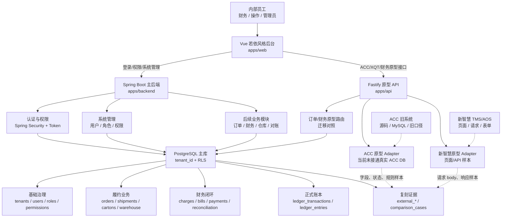
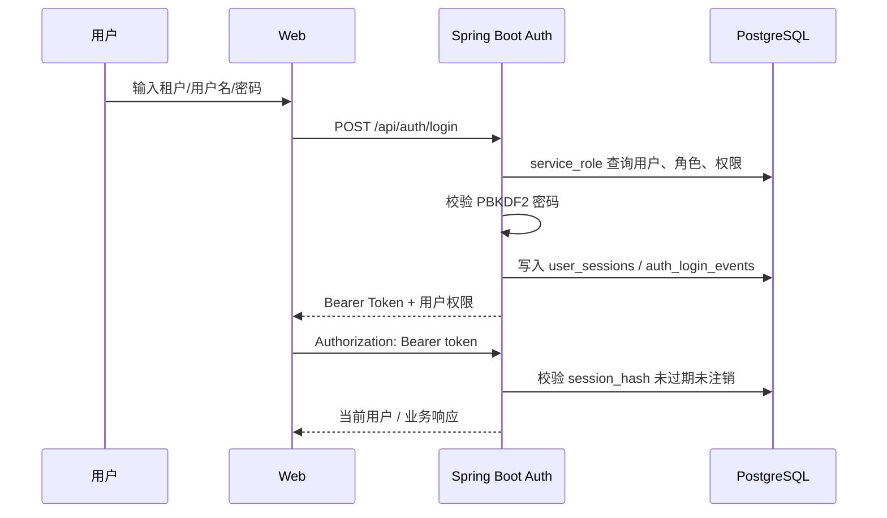
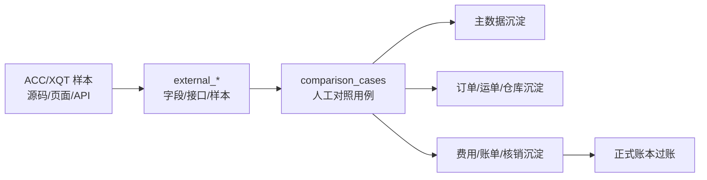
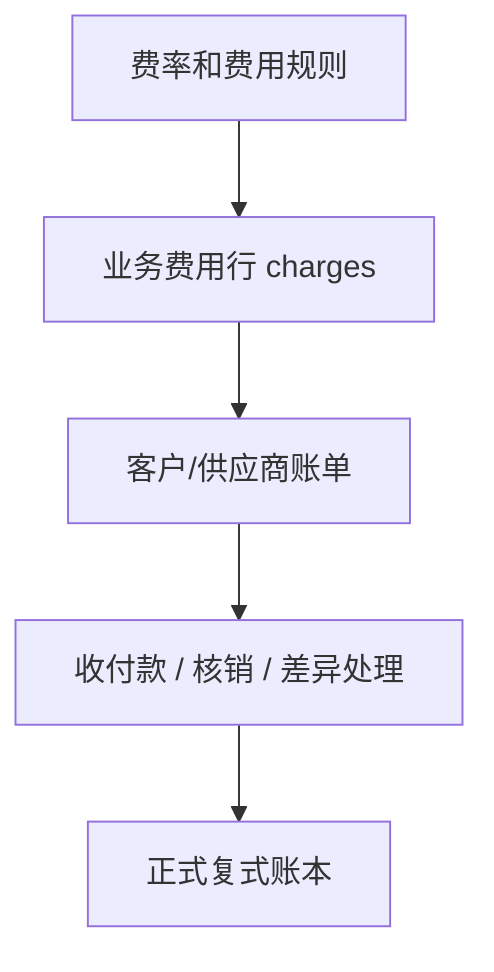
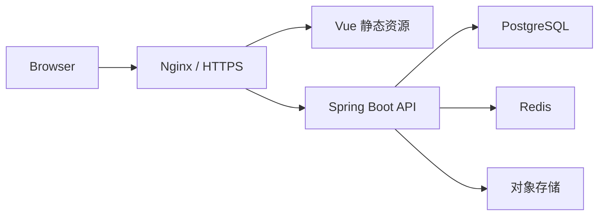

# 新航线统一平台设计与架构文档

版本：2026-05-06  
适用阶段：MVP / ACC 与新智慧复刻一期

## 1. 项目定位

新航线统一平台不是 ACC 或新智慧的套壳，也不是长期依赖旧系统的中间层。平台目标是建立新的主业务系统，统一承载订单、运单、仓库、费用、账单、核销、账本、权限、审计和运营后台。

ACC 和新智慧在本项目里的定位：

| 系统 | 当前条件 | 新系统中的作用 | 长期关系 |
| --- | --- | --- | --- |
| ACC | 有源码，当前真实数据库未接通 | 反推旧业务逻辑、字段、状态、计费规则 | 被复刻和替代 |
| 新智慧 | 无源码，有页面和请求样本 | 反推页面、表单、API body、财务口径 | 被复刻和优化 |
| 新航线统一平台 | 已有主库、Spring Boot 后端、Vue 前端 | 新业务事实来源和统一操作入口 | 目标主系统 |

核心原则：

1. 新业务以主库为准，不把 ACC 或新智慧作为长期写入依赖。
2. 外部系统字段进入 `external_*` 映射层，验证后再沉淀到主业务模型。
3. 没有历史数据接入时，通过页面、接口、表单、金额、状态的人工对照验证复刻准确性。
4. MVP 采用模块化单体，不在 3 人 3 周阶段拆微服务。

## 2. 当前技术选型

| 层级 | 技术 | 当前路径 | 说明 |
| --- | --- | --- | --- |
| 前端 | Vue 3 + Vite + lucide 图标 | `apps/web` | 若依风格后台壳，左侧菜单、顶部栏、页签、表格工具区 |
| 主后端 | Java 17 + Spring Boot 3.5.x | `apps/backend` | 新主后端，已实现登录、会话、权限、管理基础 API |
| 原型 API | Fastify + TypeScript | `apps/api` | 早期 ACC/XQT/财务验证路由，后续逐步迁入 Spring Boot |
| 数据库 | PostgreSQL + RLS | `db/migrations`, `db/seeds` | 主业务库，所有核心业务表带 `tenant_id` |
| 缓存/任务 | Redis | `infra/docker-compose.yml` | 后续用于导入、对账、轨迹同步、重试 |
| 文档 | Markdown + Mermaid + SVG/PDF | `docs` | 架构、数据库、接口、分工、复刻依据 |

当前运行约定：

| 服务 | 默认地址 | 当前用途 |
| --- | --- | --- |
| Web | `http://localhost:5173` | 用户访问入口 |
| Spring Boot API | `http://localhost:18103` | 登录、鉴权、系统管理基础 API |
| Fastify 原型 API | `http://localhost:18080` | ACC/XQT/财务原型接口 |
| PostgreSQL | `localhost:5432` 或 Docker `15432` | 当前本机使用 `5432` |

前端代理规则：

| 前端路径 | 代理目标 | 说明 |
| --- | --- | --- |
| `/api/auth/*` | Spring Boot `18103` | 登录、登出、当前用户 |
| `/api/admin/*` | Spring Boot `18103` | 用户、角色、权限 |
| `/api/health` | Spring Boot `18103` | 新后端健康检查 |
| `/api/*` | Fastify `18080` | 现有业务原型接口 |
| `/health` | Fastify `18080` | 外部适配器健康检查 |

## 3. 总体架构



## 4. 前端设计

前端目标是采用若依风格的后台操作体验，但不直接套用若依完整前端代码。

### 4.1 页面结构

当前 `apps/web` 已具备：

| 区域 | 设计 |
| --- | --- |
| 登录页 | 统一平台登录，租户、用户名、密码 |
| 左侧菜单 | 分组菜单：工作台、业务复刻、系统治理 |
| 顶部栏 | 折叠菜单、面包屑、消息、全屏、设置、用户信息 |
| 页签栏 | 类若依 tag-view，可切换和关闭页面 |
| 内容区 | 驾驶舱、ACC、XQT、分公司、系统管理 |
| 表格工具区 | 查询、重置、新增、审核、导出、业务动作 |

### 4.2 前端模块

| 模块 | 当前状态 | 下一步 |
| --- | --- | --- |
| 登录 | 已接 Spring Boot `/api/auth/login` | 增加验证码/记住租户 |
| 驾驶舱 | 接 Fastify 财务概览 | 迁到 Spring Boot 聚合接口 |
| ACC | 大量原型页面和表格已存在 | 接真实 ACC DB 后做对照 |
| 新智慧 | 当前是占位和文档支撑 | 按财务模块请求复刻页面 |
| 系统管理 | 有用户/角色/权限/日志/配置入口 | 后端逐步迁入 Spring Boot |

### 4.3 设计原则

1. 业务系统优先表格、筛选、批量操作、状态标签，不做营销式页面。
2. 普通管理页采用若依式紧凑布局。
3. 财务和订单页面保留可追溯字段，不隐藏关键金额、状态、来源。
4. 所有危险操作需要二次确认，后续接操作日志和审计。

## 5. 后端设计

### 5.1 Spring Boot 主后端

路径：`apps/backend`

当前已实现：

| API | 说明 |
| --- | --- |
| `GET /api/health` | 应用和数据库健康检查 |
| `POST /api/auth/login` | 登录 |
| `GET /api/auth/me` | 当前用户 |
| `POST /api/auth/logout` | 退出登录 |
| `GET /api/admin/users` | 用户列表 |
| `GET /api/admin/roles` | 角色列表 |
| `GET /api/admin/permissions` | 权限列表 |

当前包结构：

```text
com.xqt.saas
  auth
  admin
  common
  health
```

目标包结构：

```text
com.xqt.saas
  auth
  admin
  common
  health
  module
    masterdata
    order
    shipment
    warehouse
    finance
    reconciliation
    ledger
    external
  adapter
    acc
    xqt
  infrastructure
    tenant
    audit
    redis
    db
  job
```

### 5.2 认证与权限

认证链路：



权限模型：

| 表 | 说明 |
| --- | --- |
| `users` | 主系统用户 |
| `roles` | 角色 |
| `permissions` | 权限点，采用 `resource.action` 编码 |
| `user_roles` | 用户角色绑定 |
| `role_permissions` | 角色权限绑定 |
| `user_sessions` | 登录会话 |
| `auth_login_events` | 登录审计 |

后端权限判断使用 Spring Security authority，对应 `permissions.code`。

### 5.3 Fastify 原型 API

路径：`apps/api`

保留原因：

1. 已经承载大量 ACC 原型路由。
2. 已经承载新智慧财务请求采集和只读接口验证成果。
3. 可作为迁移对照，不阻塞 Spring Boot 主后端推进。

迁移原则：

1. 新功能优先写 Spring Boot。
2. 已验证稳定的 Fastify 路由逐步迁到 Spring Boot。
3. 迁移完成一个模块，前端代理切换一个模块。
4. Fastify 最终仅保留临时对照工具，或下线。

## 6. 数据库设计

数据库采用 PostgreSQL，所有核心业务表以 `tenant_id` 做租户隔离，并启用 RLS。

### 6.1 表分层

| 层级 | 代表表 | 说明 |
| --- | --- | --- |
| 租户与权限 | `tenants`, `users`, `roles`, `permissions` | 登录、授权、审计基础 |
| 组织与主数据 | `organizations`, `customers`, `partners`, `service_products`, `charge_types` | 客户、供应商、渠道、产品、费用类型 |
| 订单履约 | `orders`, `shipments`, `cartons`, `tracking_events` | 兼容 ACC 委托运输和新智慧运单 |
| 仓库作业 | `warehouses`, `warehouse_receipts`, `warehouse_tasks`, `scan_events` | 收货、拣货、装车、扫描 |
| 计费费用 | `charges`, `rate_rules`, `rate_versions` | 业务费用、规则版本、费用快照 |
| 应收应付 | `customer_bills`, `supplier_bills`, `payments`, `receipts`, `settlements` | 账单、付款、收款、核销 |
| 正式账本 | `ledger_accounts`, `ledger_transactions`, `ledger_entries`, `posting_batches` | 不可变复式账本 |
| 外部复刻 | `external_systems`, `external_modules`, `external_field_mappings`, `external_payload_snapshots`, `comparison_cases` | ACC/XQT 对照证据 |

### 6.2 数据流



### 6.3 设计原则

1. 不照搬 ACC 表结构，只抽取业务语义。
2. 不使用 ACC/XQT 原始 ID 作为主系统主键。
3. 外部 ID 放入 `external_object_refs`。
4. 外部请求和响应样本放入 `external_payload_snapshots`。
5. 关键金额进入主系统后必须保留来源、币种、规则快照和操作审计。
6. 账本一旦过账不可修改，只能冲销或调整。

## 7. ACC 复刻设计

ACC 当前状态：

| 项 | 状态 |
| --- | --- |
| 源码阅读 | 已完成 API 和数据库反推文档 |
| 原型 adapter | `apps/api/src/adapters/acc-adapter.ts` 已有大量查询和操作方法 |
| 原型路由 | `/api/acc/*` 已覆盖订单、财务、客户、渠道、仓库等 |
| 真实连接 | 当前未接通 ACC MySQL，健康检查提示默认 root 无密码被拒绝 |
| Spring Boot 集成 | 尚未迁入，属于后续 P3 |

ACC 复刻路线：

1. 接通 ACC 真实只读数据库。
2. 对订单、费用、账单、客户、渠道、状态做样本抽取。
3. 建立字段映射和状态映射。
4. 用 `comparison_cases` 做典型用例对照。
5. 将通过验证的逻辑迁入 Spring Boot。
6. 前端从 `/api/acc/*` 切到主系统模块 API。

## 8. 新智慧复刻设计

新智慧当前状态：

| 项 | 状态 |
| --- | --- |
| 源码 | 无 |
| 页面/API 样本 | 已采集只读请求和财务模块 POST body |
| 文档 | `docs/xqt-readonly-api-crawl.md`, `docs/xqt-finance-api-requests.md` |
| 真实写入 | 不提交数据，只做只读采集和表单反推 |
| 主系统复刻 | 先从财务模块开始 |

新智慧财务优先模块：

| 模块 | 复刻目标 |
| --- | --- |
| 财务流水 | 查询、筛选、状态、来源、金额字段 |
| 客户流水 | 客户维度收支明细 |
| 客户账单 | 账单生成、账单明细、收款核销 |
| 供应商流水 | 供应商维度应付和付款 |
| 供应商账单 | 成本账单、对账、差异 |
| 账户/账户流水 | 公司、客户、供应商、员工账户 |
| 审核审批 | 保留审核状态、审核时间、审核人 |

复刻原则：

1. 不向新智慧提交任何写操作。
2. 每个 POST 请求 body 均进入文档和样本库。
3. 页面字段、筛选项、选项来源需要记录。
4. 主系统实现时不直接复制新智慧表结构，而是映射到主系统财务模型。

## 9. 财务与账本设计

财务模块拆分为四层：



关键边界：

| 概念 | 定义 |
| --- | --- |
| 费用行 | 业务计费结果，可重算但必须保留规则快照 |
| 账单 | 面向客户或供应商的结算单，可有版本 |
| 核销 | 收付款与账单/费用的匹配关系 |
| 账本 | 正式财务记录，不可随意修改 |

痛点改进：

1. 费用来源可追溯。
2. 账单生成可复盘。
3. 成本导入可匹配到订单/子单。
4. 差异进入人工处理队列。
5. 正式账本和业务账单分离，避免修改业务单据破坏历史财务口径。

## 10. 部署与启动

本地推荐启动方式：

```bash
# 主后端
cd apps/backend
env -u DEBUG API_PORT=18103 SPRING_DATASOURCE_URL=jdbc:postgresql://localhost:5432/xqt_saas ./mvnw spring-boot:run

# 原型 API
API_PORT=18080 npm run dev -w apps/api

# 前端
WEB_PORT=5173 API_PORT=18080 SPRING_API_PORT=18103 npm run dev -w apps/web -- --port 5173 --strictPort --host 0.0.0.0
```

当前使用 `screen` 后台会话：

| 会话 | 说明 | 停止 |
| --- | --- | --- |
| `xqt-web-5173` | 前端 | `screen -S xqt-web-5173 -X quit` |
| `xqt-backend-18103` | Spring Boot 后端 | `screen -S xqt-backend-18103 -X quit` |

生产部署建议：



生产阶段不建议继续暴露 Fastify 原型 API；应逐模块迁入 Spring Boot。

## 11. 开发阶段计划

### P0：基础平台

- Spring Boot 登录、登出、当前用户。
- 用户、角色、权限查询。
- 若依风格前端后台壳。
- 主库权限种子和租户隔离。
- 系统健康检查。

### P1：新智慧财务复刻

- 按 `docs/xqt-finance-api-requests.md` 做财务页面。
- 实现财务流水、客户账单、供应商账单、账户流水。
- 建立请求 body、页面字段、主库字段映射。
- 做只读对照，不向新智慧提交数据。

### P2：订单、运单、仓库闭环

- 订单、运单、箱、仓库收货、扫描事件。
- 状态机和轨迹事件。
- 与 ACC/XQT 样本做字段和状态对照。

### P3：ACC 业务逻辑迁移

- 接通 ACC 真实只读数据库。
- 迁移核心订单、费用、账单、客户、渠道逻辑。
- 逐条建立对照样本和测试用例。
- 将 `/api/acc/*` 从 Fastify 迁到 Spring Boot。

### P4：财务闭环和旧系统替代

- 成本导入、自动对账、差异处理。
- 收付款、核销、账本过账。
- 前端从原型接口切到主系统接口。
- ACC 和新智慧降级为只读对照或历史归档。

## 12. 风险与决策

| 风险 | 影响 | 应对 |
| --- | --- | --- |
| ACC 真实数据库未接通 | 无法验证旧逻辑真实数据 | 先接只读账号，再做样本对照 |
| 新智慧无源码 | 只能页面/API 反推 | 保留请求 body、页面字段、响应样本 |
| Fastify 与 Spring Boot 并存 | 接口分散 | 前端代理明确分流，逐模块迁移 |
| 财务逻辑复杂 | 金额口径容易偏差 | 建立对照用例，费用和账本分层 |
| 多租户隔离误用 | 数据越权风险 | 统一租户上下文工具，依赖 PostgreSQL RLS |
| 过早微服务化 | 3 人团队复杂度过高 | MVP 坚持模块化单体 |

## 13. 相关文档

| 文档 | 用途 |
| --- | --- |
| `docs/system-architecture.md` | 详细总体架构 |
| `docs/main-system-database-design.md` | 主数据库结构设计 |
| `docs/spring-boot-implementation-plan.md` | Java/Spring Boot 落地方案 |
| `docs/ruoyi-framework-research.md` | 若依框架调研 |
| `docs/xqt-finance-api-requests.md` | 新智慧财务请求 body |
| `docs/xqt-readonly-api-crawl.md` | 新智慧只读接口采集 |
| `docs/acc-api-reverse-db-design.md` | ACC API 反推数据库设计 |
| `docs/assets/system-architecture.pdf` | 总体架构图 PDF |

