# 软件操作手册（XQT-SaaS 货代物流多租户平台）

> 版本：2026-05-29
> 适用：S1-S9 ACC 全量迁移 + 利润 listener + 银行/支付/汇率 feed 抽象 + 8.148.227.76 生产部署
> 适用读者：运营 / 财务 / 客服 / 系统管理员 / 一线业务

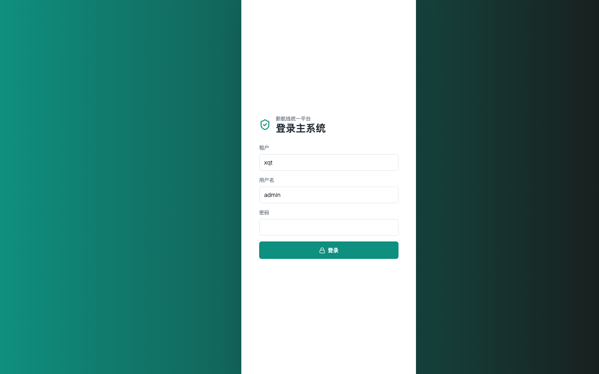

---

## 0. 一页速览

| 维度 | 现状 |
|------|------|
| 测试基线 | **226 / 226 全绿** |
| 后端 | Spring Boot 3.5 + JDBC + Postgres 16 + Redis 7（80+ controller） |
| 前端 | Vue 3 + Vite + TS（运营后台 SPA） |
| 数据库 | 47 migrations + 8 seeds，210 张表，RLS tenant + user 级 |
| 部署 | docker compose（postgres + redis + backend + web）；生产位于 `root@8.148.227.76:18080` |
| 核心 ACC 能力 | 客户 API 下单 / Submit 取号补偿 / 多源轨迹 / 配载状态机 / 利润结算 / 关键词附加费 / RLS 权限 / 强关联表 / 面单格式转换 |

---

## 1. 系统模块速查表

### 1.0 主驾驶舱

登录后默认进入"驾驶舱"看板，含总营收 / 总成本 / 毛利 / 运单数 / 账单数 5 个 KPI 卡片 +
DataGear 风格"两线业务经营看板" + 货物轨迹地图。左侧 5 个一级菜单覆盖全平台功能：

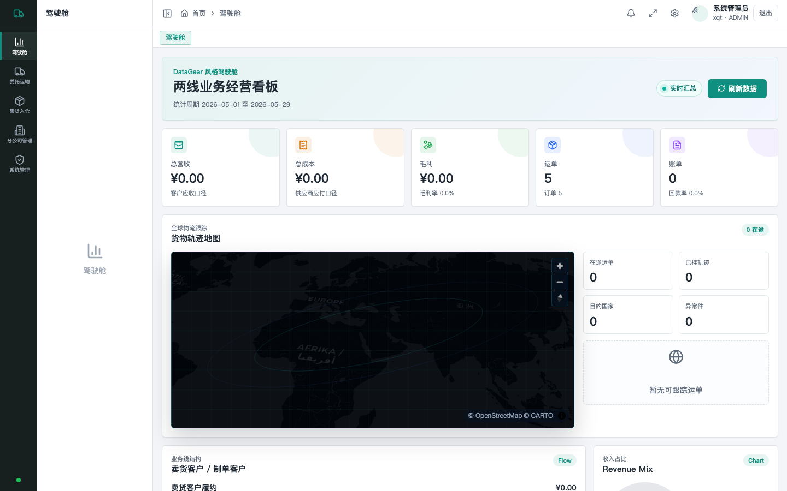

按业务面板分组，每条对应前端菜单项与后端 controller：

### 1.1 主数据（22 项）
| 菜单 | 端点 | 说明 |
|------|------|------|
| 客户 | `/api/acc/customers` | 含 salesman_user_id、branch_id（影响 RLS） |
| 客户组 | `/api/acc/customer-groups` | 用于组价匹配 |
| 渠道 | `/api/acc/channels` | dim_factor / primary_uom |
| 渠道账号 | `/api/acc/channel-accounts` | 用于真实 provider 路由 |
| 国家 / 地区 | `/api/acc/countries` `/districts` | |
| 银行 / 户名 | `/api/acc/banks` `/bank-names` | |
| 货币 | `/api/acc/currencies` | base_currency 影响 fx 快照 |
| 仓库 | `/api/acc/warehouses` | |
| 部门 / 职位 / 员工 | `/api/acc/departments` `/positions` `/employees` | 员工 branch_id 是 BRANCH_MANAGER 隔离基准 |
| 分公司（组织） | `/api/acc/branches` | 与 users.branch_id 关联 |
| 港口 | `/api/acc/stowage-ports` | |
| 配载分类 | `/api/acc/stowage-categories` | |
| 佣金规则 | `/api/acc/commission-rules` | 客户/组/服务/渠道四级优先 |
| 资产 / 借款 / 押金 | `/api/acc/assets` `/borrowings` `/detains` | |

### 1.2 订单 / 物流（10 项）
| 菜单 | 端点 | 关键点 |
|------|------|--------|
| 订单 | `/api/acc/orders` | 含 sellCharge/costCharge/branch 实时聚合 |
| Shipments | `/api/acc/shipments` | 含 `/timeline` 多源轨迹 |
| 货品申报 | `/api/acc/...` | declare[name/quantity/price]，关键词附加费匹配 |
| 配载 | `/api/acc/stowages` | status=CONFIRMED 触发状态机 → tracking_events + shipments.status=IN_TRANSIT |
| 转运 | `/api/acc/transits` | status=IN_TRANSIT → 通过 acc_transit_items 联动 |
| 派送 | `/api/acc/dispatches` | status=PICKED→OUT_FOR_DELIVERY；DONE→DELIVERED + 利润结算 listener |
| 预报 | `/api/acc/forecasts` | |
| 提货 | `/api/acc/collects` | |
| 退货 | `/api/acc/return-orders` | |
| 异常单 | `/api/acc/exceptions` | |

订单列表（任务 S4 sellCharge / costCharge / branch 实时聚合生效）：

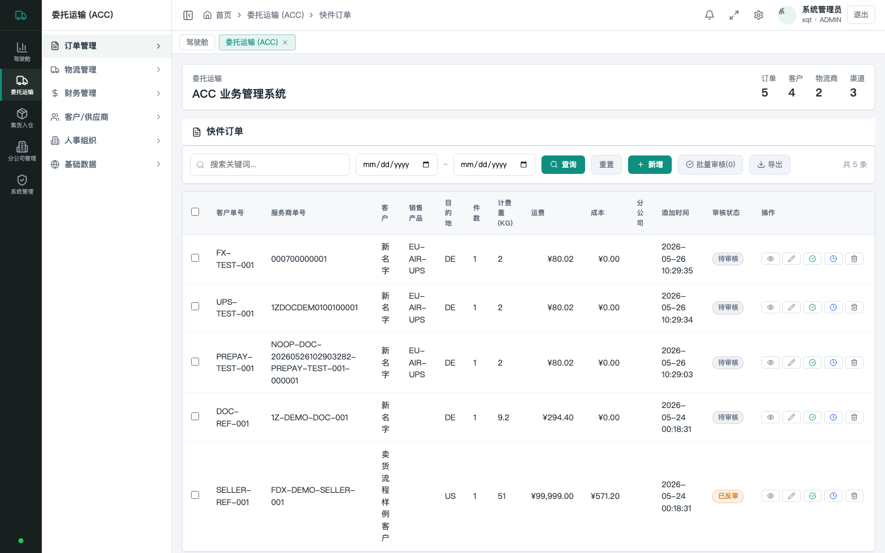

出货管理列表：

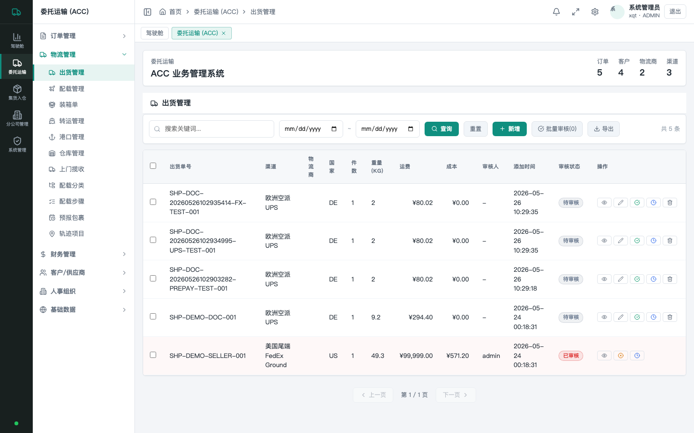

配载管理列表（状态机 CONFIRMED 触发点）：

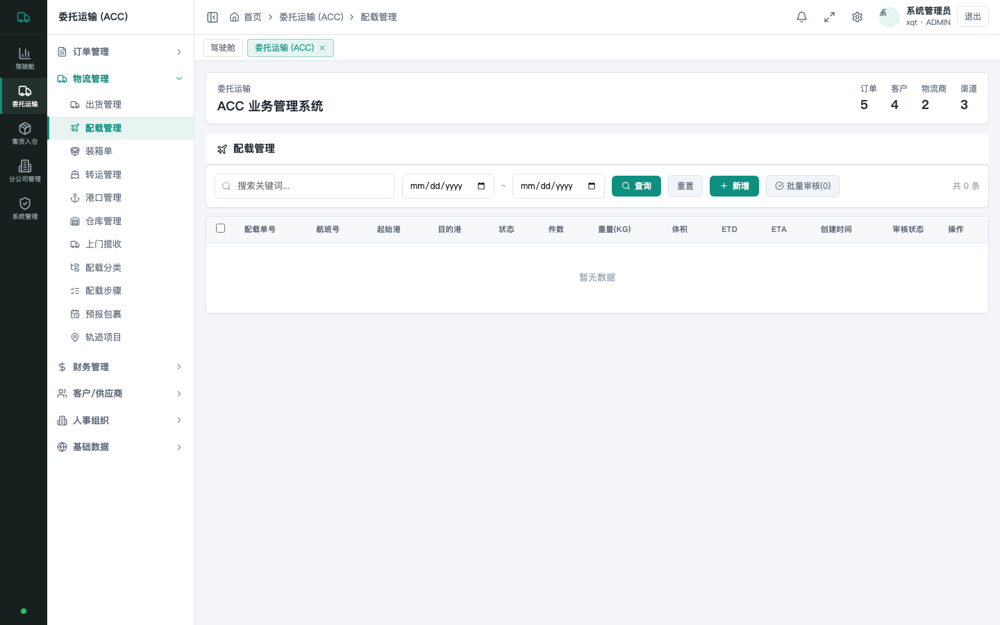

### 1.3 财务（21 项）
| 菜单 | 端点 | 关键点 |
|------|------|--------|
| 应收账单 | `/api/acc/bills` | |
| 收款 | `/api/acc/customer-payments` | |
| 客户调账 / 返利 / 退款 / 罚款 / 赔偿 | `/api/acc/customer-adjusts` `customer-rebates` `customer-refunds` `customer-fines` `customer-claims` | 审核入账自动写 balance_ledger + fx 快照 |
| 供应商账单 / 调账 / 返利 / 退款 / 罚款 / 赔偿 | `/api/acc/supplier-*` | 同上 |
| 费用行 | `/api/acc/charges` | AR/AP 拆 6 行（FREIGHT/FUEL/REMOTE × side） |
| 利润 | `/api/acc/profits` | 妥投时 ProfitSettlementListener 写 profit_snapshots |
| 佣金 / 分红 | `/api/acc/commissions` `/dividends` | |
| 询问 / 借款 | `/api/acc/asks` `/borrowings` | |
| 工资 / 考勤 | `/api/acc/salaries` `/attendances` | |

应收运费列表（charges 表，AR 行）：

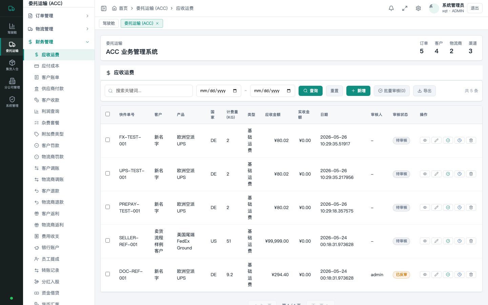

利润查询（ProfitSettlementListener 妥投自动写入 + on-the-fly 兜底）：

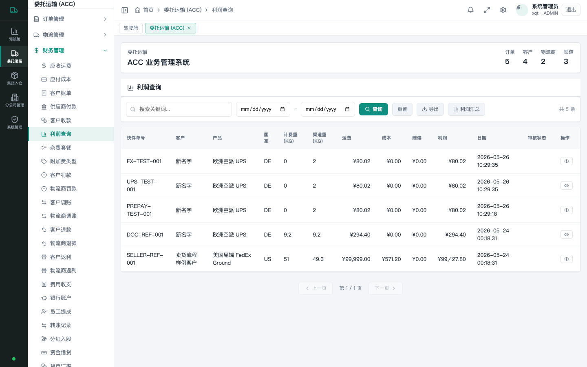

客户调账（审核入账自动写 balance_ledger + fx 快照）：

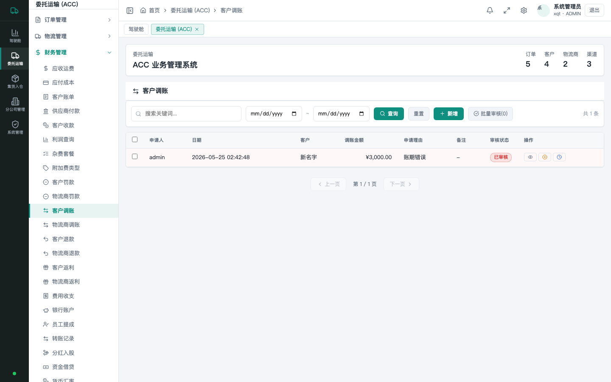

### 1.4 报表 / 看板
| 菜单 | 端点 | 说明 |
|------|------|------|
| 财务看板 | `/api/finance/dashboard` | AR / AP / 现金流 |
| 分公司看板 | `/api/finance/branches` | |
| 健康检查 | `/actuator/health` | 容器 healthcheck 用 |
| Swagger UI | `/swagger-ui.html` | API 在线浏览 |

---

## 2. 部署 / 启动 / 升级

### 2.1 首次部署

参考 `docs/acc-deployment-2026-05-29.md`。一句话：

```bash
cd /opt/xqt-saas/repo
git pull
cd /opt/xqt-saas
docker compose up -d --build
```

**前置条件**：
- 服务器 docker daemon 配 registry-mirrors（防 docker.io 拉不到）
- `.env` 含 `JWT_SECRET`（不能空），`POSTGRES_PASSWORD`
- `/opt/xqt-saas/apps` 软链到 `repo/apps`
- 阿里云安全组开放 `18080`（外部访问 web）

### 2.2 增量升级

源码改动后：

```bash
ssh root@8.148.227.76
cd /opt/xqt-saas/repo
git pull
cd /opt/xqt-saas
docker compose build backend web    # 只重建变化的服务
docker compose up -d backend web    # 滚动替换，不停 PG/Redis
```

### 2.3 增量 migration

**postgres `/docker-entrypoint-initdb.d/` 只在首次启动有效**。后续新 migration（如 048+）需手动应用：

```bash
docker exec -i xqt-postgres psql -U xqt -d xqt_saas \
  < /opt/xqt-saas/repo/db/migrations/048_xxx.sql
```

### 2.4 回滚

```bash
cd /opt/xqt-saas
docker compose down
# 或 checkout 旧版本
cd repo && git checkout <prev-commit>
cd .. && docker compose up -d --build
```

---

## 3. 默认账号

| 用户名 | 默认密码 | 角色 | 权限 |
|--------|----------|------|------|
| `admin` | `Test@1234` *(部署时已重置)* | ADMIN | 全可见 |
| `finance` | （未重置） | FINANCE_MANAGER | 全可见 |

**⚠️ 上线前必做**：
- 改 admin 密码（参见 §6.1）
- 改 `.env` 中 `POSTGRES_PASSWORD`
- 轮换服务器 SSH 密码

### 角色权限矩阵（migration 044 + 047）

| 角色 | customers | shipments | orders |
|------|-----------|-----------|--------|
| ADMIN / FINANCE | 全 tenant | 全 tenant | 全 tenant |
| SALESMAN | 自己负责的客户（customers.salesman_user_id = 当前用户） | 自己客户的票 | 自己客户的订单 |
| BRANCH_MANAGER | 全 tenant | 本分公司（shipments.branch_id = 当前用户.branch_id） | 本分公司 |
| **空 branch_id 的 BRANCH_MANAGER** | 全 tenant | 全 tenant（容错回退） | 全 tenant |

---

## 4. 业务操作典型流程

### 4.1 客户下单 → 取号 → 出运 → 妥投 → 利润结算

```
1. 客户 API 调 /api/customer-api/orders/preorder
   ↓
2. /api/customer-api/orders/submit
   - RateEngine.quote() 算 AR/AP 真实费用
   - 扣余额（balance_ledger PREPAY，fx 快照自动捕获）
   - 渠道取号（CarrierGateway.submit）
   - shipment_order_links 建强关联（任务 S8）
   - RateEngine.applyKeywordSurcharges() 落品名附加费 AR 行（任务 S3 A1）
   - 失败时 SubmitCompensationService 触发补偿（任务 S2）
   ↓
3. 后台 /api/acc/stowages PUT status=CONFIRMED
   - StowageStateMachine.onStowageConfirmed
   - tracking_events 写 STOWAGE_CONFIRMED 节点
   - shipments.status DRAFT→IN_TRANSIT
   ↓
4. /api/acc/transits PUT status=IN_TRANSIT
   - StowageStateMachine.onTransitInTransit
   - acc_transit_items 关联表 → fanout 到 shipments
   - tracking_events 写 TRANSIT_DEPARTED 节点
   ↓
5. /api/acc/dispatches PUT status=PICKED 或 DONE
   - PICKED → OUT_FOR_DELIVERY tracking_events
   - DONE  → DELIVERED tracking_events + shipments.status=DELIVERED
   - DONE 触发 ShipmentDeliveredEvent
   ↓
6. ProfitSettlementListener 接住 event
   - 聚合 charges: AR - AP - commission = gross_profit
   - 写 profit_snapshots
   - documentcharges AR/AP close
```

### 4.2 财务审核流程

```
1. /api/acc/customer-adjusts POST 录入调账
2. /api/acc/audit PUT 改 audit_status=AUDITED
   - FinanceTxnAuditSideEffect 触发
   - balance_ledger 写一条 (ADJUST/REFUND/REBATE/VOID)
   - fx 快照自动捕获（任务 S6 + 收口 commit 8ad3517）
3. /api/acc/audit PUT 改 audit_status=UNAUDITED（反审）
   - 自动冲正：写一条反向 balance_ledger（biz_type=VOID）
```

### 4.3 主数据维护（运营）

通用流程（所有 22 个主数据 tab 一致）：
1. 列表页 GET `/api/acc/<tab>?page=1&pageSize=20&keyword=`
2. 新增 POST `/api/acc/<tab>` body=json
3. 编辑 PUT `/api/acc/<tab>/{id}` body=json
4. 审核 PUT `/api/acc/audit` body={table, id, status}
5. 删除 DELETE `/api/acc/<tab>/{id}`（已审核需先反审）

**字段级保护**：
- `FieldGate` 拦截审核态下修改受保护字段
- 返回 `rejectedFields` 数组提示前端

---

## 5. 日常运维

### 5.1 监控

```bash
# 容器状态
ssh root@8.148.227.76 'cd /opt/xqt-saas && docker compose ps'

# 健康检查
ssh root@8.148.227.76 'docker exec xqt-backend wget -qO- http://localhost:8080/actuator/health'

# 实时日志
ssh root@8.148.227.76 'cd /opt/xqt-saas && docker compose logs -f backend --tail 100'

# Postgres 连接数 / 慢查询
docker exec xqt-postgres psql -U xqt -d xqt_saas -c "SELECT count(*), state FROM pg_stat_activity GROUP BY state;"
```

### 5.2 备份

```bash
# 全库导出（每天 cron）
docker exec xqt-postgres pg_dump -U xqt xqt_saas | gzip > /backup/xqt_$(date +%Y%m%d).sql.gz

# 单表备份（如 profit_snapshots）
docker exec xqt-postgres pg_dump -U xqt -d xqt_saas -t profit_snapshots > profit.sql

# 恢复
gunzip -c /backup/xqt_20260529.sql.gz | docker exec -i xqt-postgres psql -U xqt -d xqt_saas
```

### 5.3 定时任务

| 任务 | 触发 | 实现 | 配置 |
|------|------|------|------|
| FxRateRefreshJob | 每天 02:00 (HK) | `FxRateRefreshJob.refresh()` | `app.fx.refresh.cron`、`@Profile("prod")` |
| 数据库 vacuum | postgres 自动 | autovacuum | 内置 |
| **未来需补**：每日备份 cron | 系统 crontab | `pg_dump` shell | 见 §5.2 |

启用 prod profile：
```yaml
# .env or env vars
SPRING_PROFILES_ACTIVE=prod
```

### 5.4 漏配汇率排查

```sql
-- 哪些 ledger 缺 fx_rate_snapshot
SELECT bl.tenant_id, bl.currency, count(*)
FROM balance_ledger bl
LEFT JOIN fx_rate_snapshots fxs
  ON fxs.source_ref = bl.source_ref
  AND fxs.from_currency = bl.currency
WHERE fxs.id IS NULL
  AND bl.currency <> 'CNY'
GROUP BY 1, 2;

-- 哪些是 MISSING_RATE (FX feed 没拉到)
SELECT * FROM fx_rate_snapshots WHERE source = 'MISSING_RATE' ORDER BY snapshot_at DESC LIMIT 20;
```

补汇率：
```sql
INSERT INTO exchange_rates (tenant_id, rate_date, from_currency, to_currency, rate, rate_type, source)
VALUES ('<tenant>', CURRENT_DATE, 'USD', 'CNY', 7.25, 'ACCOUNTING', 'MANUAL');
```

---

## 6. 关键管理任务

### 6.1 重置 admin 密码

```bash
# 用 Python 计算新密码 hash
python3 -c "
import hashlib, base64
SALT = b'xqt-dev-admin-salt-2026'
PWD = 'YourNewStrongPassword'
dk = hashlib.pbkdf2_hmac('sha256', PWD.encode(), SALT, 210000, dklen=32)
print('pbkdf2\$sha256\$210000\$xqt-dev-admin-salt-2026\$' + base64.urlsafe_b64encode(dk).rstrip(b'=').decode())
"
# 用输出的 hash 更新 DB
docker exec -it xqt-postgres psql -U xqt -d xqt_saas -c \
  "UPDATE users SET password_hash='<hash>' WHERE username='admin';"
```

### 6.2 给销售人员分配客户

```sql
UPDATE customers SET salesman_user_id = '<userid>' WHERE id = '<customerid>';
-- 之后该销售登录后只能看到这些客户
```

### 6.2.1 客户主数据列表

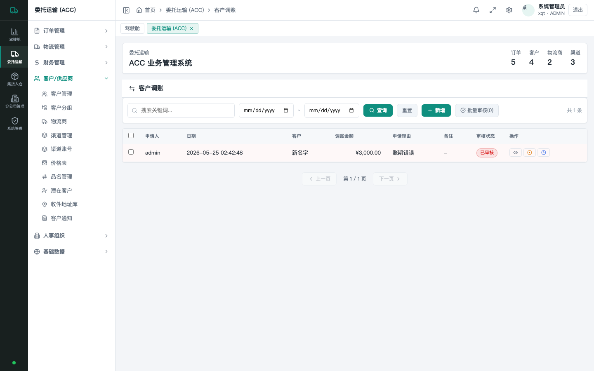

### 6.2.2 渠道主数据列表

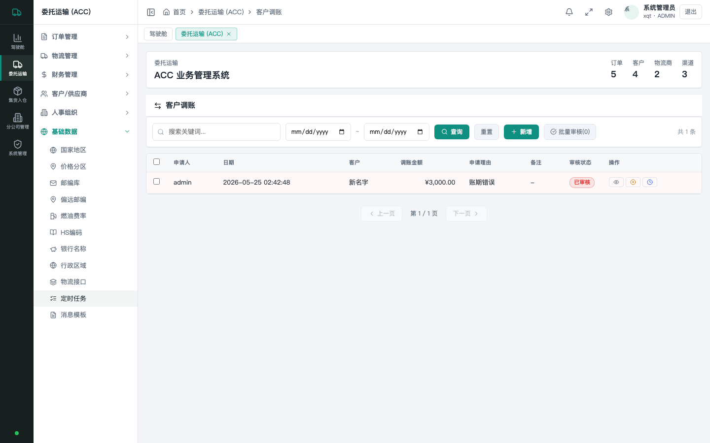

### 6.3 给分公司经理分配 branch

```sql
-- 1. 给用户填 branch_id
UPDATE users SET branch_id = '<branchid>' WHERE username = 'bm-shanghai';

-- 2. 历史 shipments 没填 branch_id 会被该用户看不到（除非走容错路径）
-- backfill 历史数据：
UPDATE shipments SET branch_id = (
  SELECT branch_id FROM customers WHERE customers.id = shipments.customer_id
) WHERE branch_id IS NULL;
```

分公司管理界面：

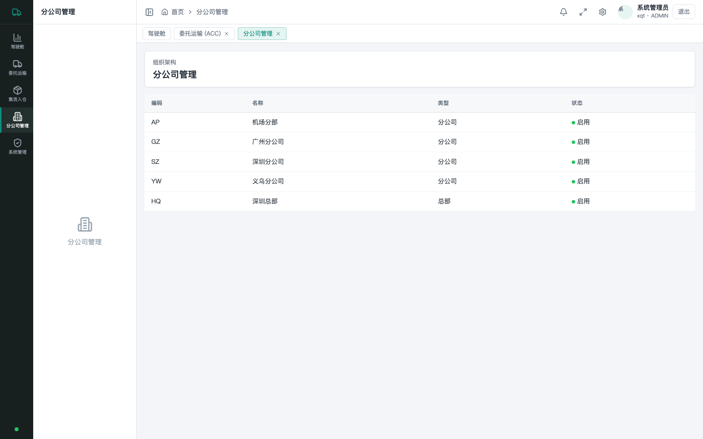

系统管理 > 用户管理（给员工分配 branch_id 的入口）：

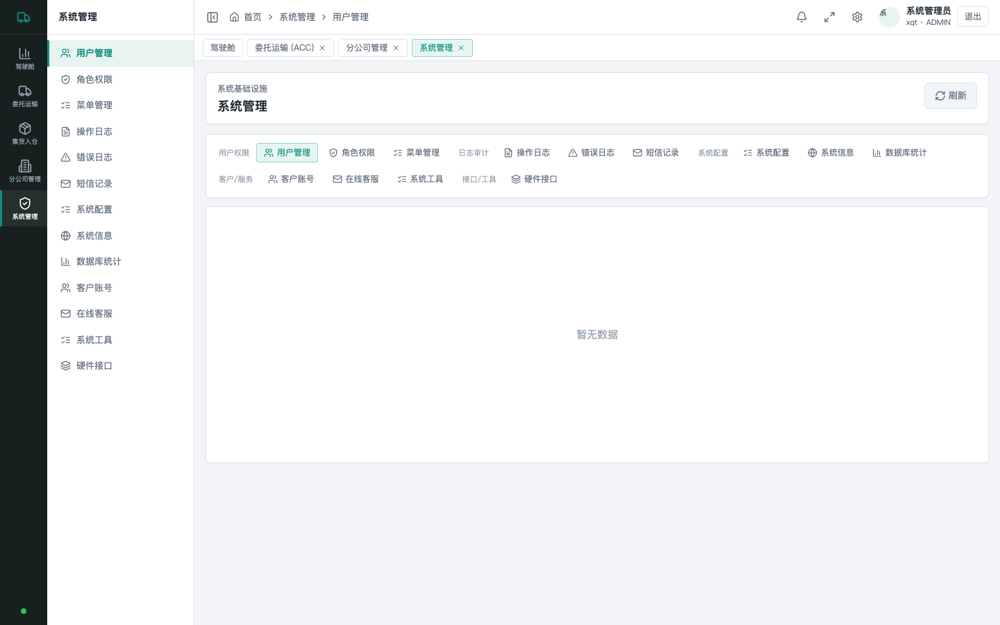

### 6.4 启用 / 禁用 strict 模式

```bash
# .env
RATES_STRICT_QUOTE=true       # 报价失败不退化为 dev 估算
APP_CARRIER_STRICT_GATEWAY=true # carrier 路由强制走 acc_channel_accounts 配置
```

### 6.5 配置品名关键词附加费

```sql
INSERT INTO product_keyword_rules (
  tenant_id, keyword, match_type, fee_code, charge_unit, amount, priority
) VALUES
  ('<tenant>', 'lithium', 'CONTAINS', 'BATTERY_SURCHARGE', 'FIXED', 80.00, 10),
  ('<tenant>', 'magnetic', 'CONTAINS', 'DANGEROUS_GOODS', 'PCT', NULL, 5);
-- PCT 类型 amount NULL，rate 改填 0.05 表示 5%
```

### 6.6 配置按箱最低 / PER_CBM 计费

```sql
UPDATE rate_card_lines
SET min_weight_per_box = 3.000,
    min_amount_per_box = 30.00,
    calculation_type = 'PER_KG'  -- 或 'PER_CBM'
WHERE rate_card_id = '<card>' AND zone_code = 'ZONE_A';
```

### 6.7 三方接入：UPS / FedEx 真实凭证

1. `db/migrations` 不动；运营在 `/api/acc/channel-accounts` 配置：
   - provider_code（如 `UPS_REST`）
   - access_key / access_secret
2. `CarrierGatewayRegistry` 按 provider_code 路由到对应实现类
3. 替换 `SandboxCarrierGateway` 的方式：写一个实现 `CarrierGateway` 接口的 `@Component`，
   `gatewayKey()` 返 `UPS_REST`
4. 启动时 `app.carrier.strict-gateway=true` 让数据驱动路由生效

### 6.8 三方接入：银行 / 支付 / 汇率（任务 listener+feeds commit `1ef21b3`）

| 第三方 | 接口 | 接入步骤 |
|--------|------|----------|
| **汇率** | `FxRateFeed` | 默认 `exchangerate.host`；替换 = 另写 `@Component` 实现接口，注释掉默认 bean |
| **银行对账** | `BankReconciliationFeed` | 默认 `SandboxBankFeed`（3 条虚拟流水）；接 ICBC/CMB/中行 = 新实现类 |
| **支付** | `PaymentGateway` | 默认 `SandboxPaymentGateway`；接 Alipay/Wechat/UnionPay/Stripe = 新实现类 |
| **物流** | `CarrierGateway` | 默认 `SandboxCarrierGateway` + `NoopCarrierGateway`；接 UPS/FedEx 同上 |
| **面单** | `LabelGateway` | 默认 `SandboxLabelGateway`；ZPL/PNG/JPG 自动经 `LabelFormatConverter` 转 PDF |

---

## 7. 故障排查

| 现象 | 诊断 | 修复 |
|------|------|------|
| 登录 401 | 用户名/密码错；JWT_SECRET 未注入 | 查 `docker exec xqt-backend env | grep JWT`；§6.1 重置密码 |
| 列表 200 但空 | RLS 策略生效但当前用户没数据 | 看 `app.user_role` / `app.user_branch_id` GUC 是否正确；考虑 §6.3 |
| POST 500 → 400 | 必填字段空（commit `0337e1e` 已修） | 看返回 `missing required field: <col>` 提示 |
| 报价 NOT_FOUND | 缺 rate_card 配置 | 在 `/api/acc/channels` + `rate_card_lines` 录入 |
| balance 不够 | 余额账户未充值或被禁 | `/api/acc/customer-payments` 充值 |
| 渠道取号失败 | provider HTTP 异常 | 看 `acc_orphan_tracking_nos` 表（任务 S2 补偿落账） |
| 妥投后 profit 没出 | listener 异常 | 看 `docker compose logs backend | grep ProfitSettlement` |
| FX 漏配 | feed 未配 / 网络不通 | §5.4 检查 + 手填 exchange_rates |

通用日志查询：
```bash
docker exec xqt-backend tail -f /tmp/app.log 2>/dev/null || \
ssh root@8.148.227.76 'docker compose -f /opt/xqt-saas/docker-compose.yml logs backend --tail 200 -f' | grep -i error
```

---

## 8. 配置参数完整参考

### 8.1 `.env`

```bash
# 数据库
POSTGRES_DB=xqt_saas
POSTGRES_USER=xqt
POSTGRES_PASSWORD=<必改>

# 端口
WEB_PORT=18080  # web 暴露端口（80 / 8080 已被占用时用 18080）

# JWT
JWT_SECRET=<必填，建议 64 字节随机>

# 报价 / 渠道严格模式
RATES_STRICT_QUOTE=true
APP_CARRIER_STRICT_GATEWAY=true

# Spring profile（生产开 prod 激活 FxRateRefreshJob 等定时任务）
SPRING_PROFILES_ACTIVE=prod
```

### 8.2 后端 properties / yaml

| key | 默认 | 说明 |
|-----|------|------|
| `app.fx.refresh.cron` | `0 0 2 * * *` | FX 定时刷新 cron（Asia/Hong_Kong） |
| `app.fx.refresh.bypass-rls` | true | 是否用 service_role 绕 tenant RLS |
| `app.fx.exchangerate-host.endpoint` | `https://api.exchangerate.host/historical` | feed 端点 |
| `app.fx.exchangerate-host.timeout-ms` | 5000 | HTTP 超时 |
| `app.carrier.strict-gateway` | false | 严格 carrier 路由（生产建议 true） |
| `app.rates.strict-quote` | false | 严格报价（生产建议 true） |

---

## 9. 任务 / 责任分工建议

| 角色 | 周期任务 |
|------|----------|
| 系统管理员 | §5.2 备份、§5.4 漏配汇率、§6.1 密码轮换、监控容器健康 |
| 财务 | 审核调账 / 退款 / 罚款；查 profit_snapshots；核对 fx_rate_snapshots |
| 运营 | §6.2 销售分配、§6.5 关键词附加费、主数据维护 |
| 客服 | 客户 API 问题处理、轨迹查询、orphan tracking 清理 |
| 销售 | 自己客户的订单、报价、提成 |
| 分公司经理 | 本分公司 shipments / orders / profit 报表 |

---

## 10. 关联文档清单

| 主题 | 文档 |
|------|------|
| 系统架构 | `docs/system-architecture.md` |
| 数据库设计 | `docs/main-system-database-design.md` |
| API 参考 | `docs/api-reference.md` + Swagger UI |
| 部署运维 | `docs/acc-deployment-2026-05-29.md` + `deploy/README.md` |
| 各任务 comparison case | `docs/acc-comparison-*-2026-05-29.md`（11 份） |
| 最终交付报告 | `docs/acc-migration-final-report-supplement-2026-05-29.md` |

---

## 11. 变更日志

| 日期 | 变更 | commit |
|------|------|--------|
| 2026-05-29 | listener + 银行/支付/汇率 feed 抽象 + 真实 fx feed | `1ef21b3` |
| 2026-05-29 | 部署到 `8.148.227.76`（4 容器全 Up，PG 210 表） | `e3c2964` |
| 2026-05-29 | E2E 暴露的 404/400 处理 bug 修复 | `0337e1e` |
| 2026-05-29 | AuthPrincipal.branchId + 047 双路 policy | `8a8b345` |
| 2026-05-29 | audit-gaps 补 FinanceTxn fxCapture + 047 trap 修 | `8ad3517` |
| 2026-05-29 | S3/S5/S9 收尾接入主路径 | `98da01a` |
| 2026-05-29 | S1-S9 9 项 ACC 补充任务全部完成 | `d1e6efc..1721516` |
