# 新航线统一平台软件工程图集

版本：2026-05-06  
用途：架构评审、开发交接、腾讯文档导入、后续需求评审

## 图集说明

本图集按软件工程常用定义组织：

| 层级 | 图类型 | 解决的问题 |
| --- | --- | --- |
| C4-L1 | 系统上下文图 | 系统边界、用户、外部系统依赖 |
| C4-L2 | 容器图 | 前端、后端、数据库、缓存、原型系统的部署容器关系 |
| C4-L3 | 组件图 | Spring Boot 内部组件职责和调用关系 |
| 领域设计 | 模块依赖图 | 各业务模块的依赖方向和边界 |
| 数据设计 | ERD | 认证、订单、财务、外部映射的核心关系 |
| 安全设计 | RBAC 权限图 | token、session、permission、RLS 的校验链路 |
| 动态行为 | 时序图 | 登录、API 请求生命周期 |
| 状态建模 | 状态机 | 财务费用从草稿到过账、冲正的生命周期 |
| 业务流程 | 活动/流程图 | 新智慧复刻、ACC 迁移路径 |
| 运维设计 | 部署拓扑图 | 生产部署、备份、外部网络边界 |
| 质量工程 | CI/CD 质量门禁图 | 开发到发布的工程质量链路 |

## 1. C4-L1 系统上下文图

定义：描述新航线统一平台的系统边界、主要使用者、外部系统以及数据交互方向。

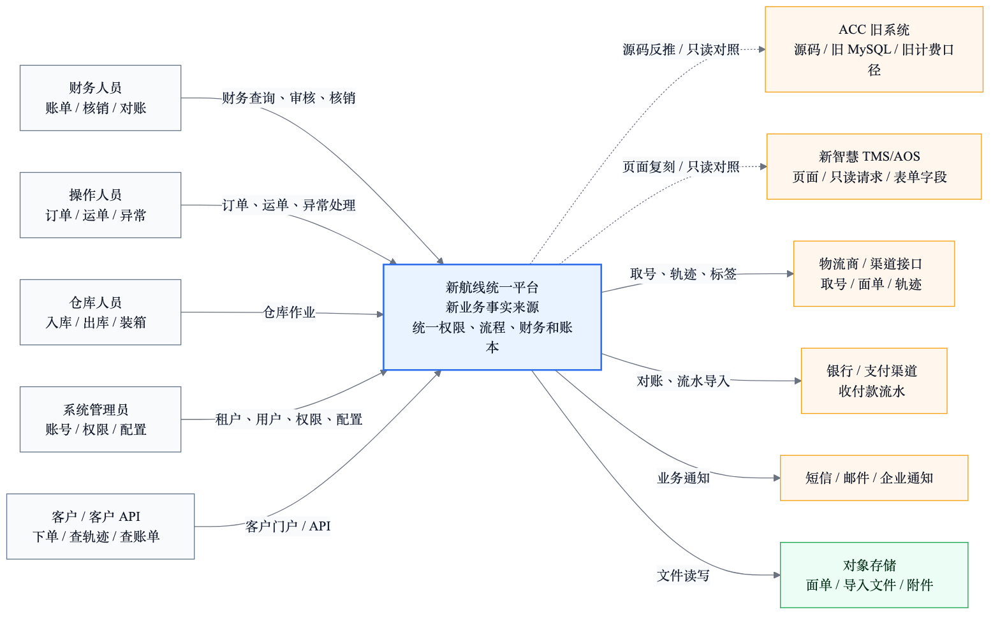

## 2. C4-L2 容器图

定义：描述系统运行容器，包括 Web、Gateway、Spring Boot、Fastify 原型、PostgreSQL、Redis、对象存储和外部系统。

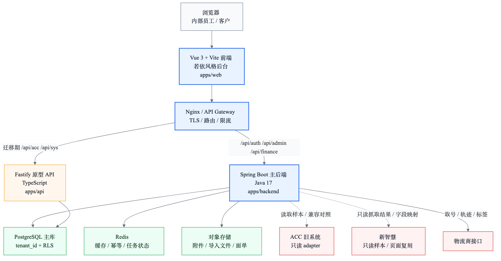

## 3. C4-L3 Spring Boot 组件图

定义：描述 Spring Boot 主后端内部组件，明确 Controller、Filter、Service、Repository、Adapter、Tenant、Audit 的职责。

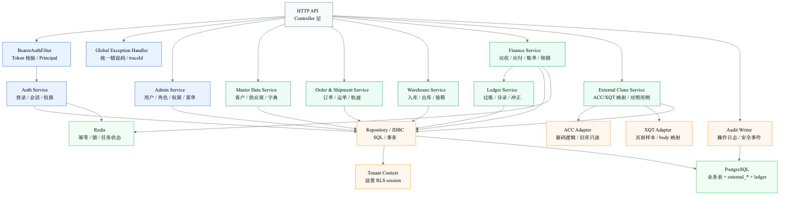

## 4. 领域模块依赖图

定义：描述认证权限、主数据、订单、运单、仓库、计费、财务、账本、对账、外部复刻之间的依赖方向。

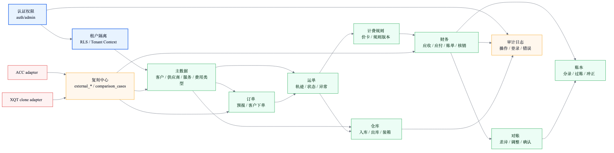

## 5. 核心数据模型 ERD

定义：描述租户、用户、角色、权限、订单、运单、费用、账单、账本、外部映射和对照用例之间的核心实体关系。

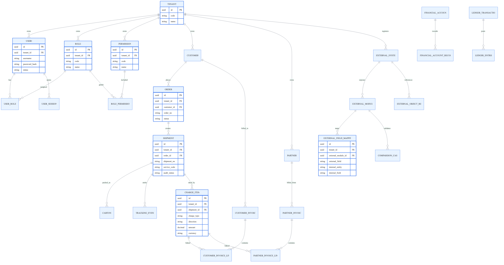

## 6. RBAC 与租户隔离权限图

定义：描述 Bearer Token、session、权限点、Controller 权限声明、Tenant Context 和 PostgreSQL RLS 的校验链路。

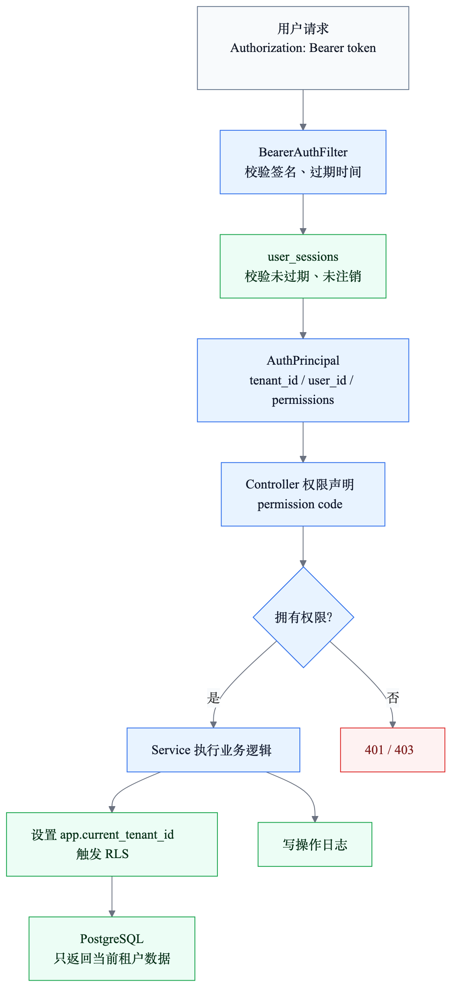

## 7. 登录与会话时序图

定义：描述登录、密码校验、Token 签发、session 写入、登录审计和 `/api/auth/me` 校验过程。

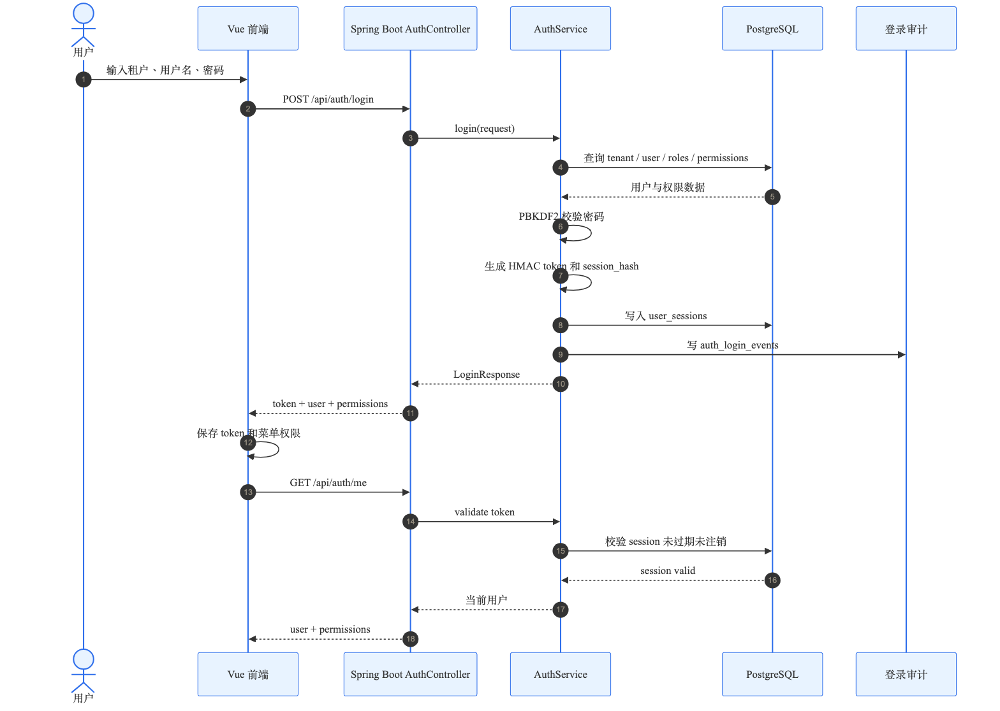

## 8. API 请求生命周期时序图

定义：描述一个标准 API 请求从前端进入后端，经过鉴权、参数校验、幂等、业务规则、RLS 查询和审计日志的完整生命周期。

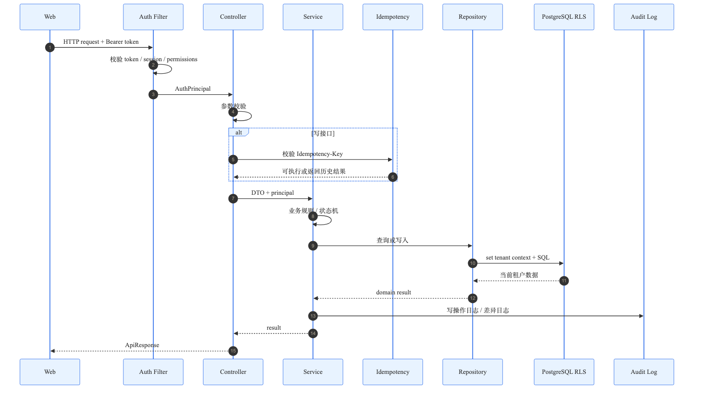

## 9. 财务费用状态机

定义：描述费用明细从草稿、审核、入账单、核销、过账到冲正/作废的状态转换。

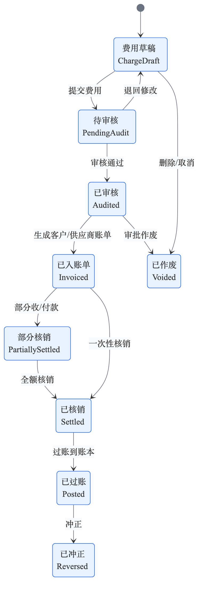

## 10. 新智慧复刻活动图

定义：描述新智慧无源码情况下，从只读页面观察、接口抓取、字段映射、主系统 API、页面复刻到人工对照的流程，并明确禁止写操作边界。

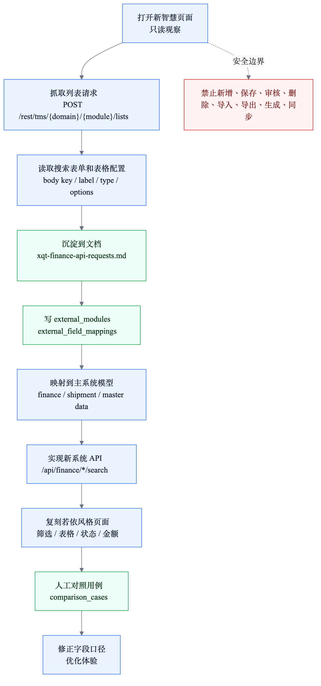

## 11. ACC 迁移流程图

定义：描述从 ACC 源码和旧库反推业务规则，经过字段映射、adapter、样本对照、差异测试，最后沉淀到主系统领域逻辑的路径。

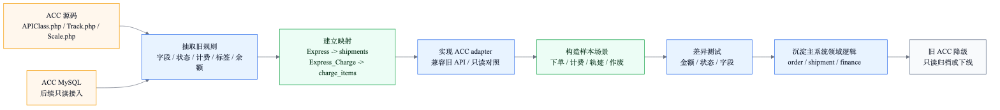

## 12. 生产部署拓扑图

定义：描述生产环境中 WAF/Nginx、Web、Spring Boot 节点、Worker、PostgreSQL、Redis、对象存储、备份和外部网络边界。

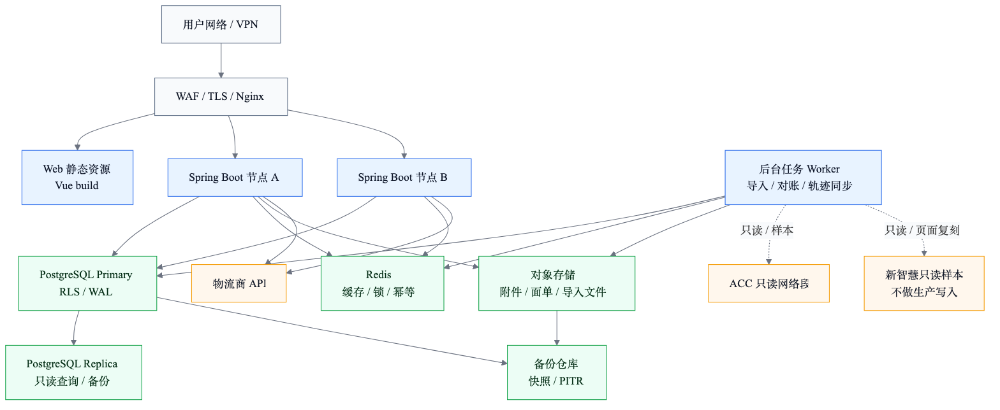

## 13. CI/CD 与质量门禁图

定义：描述从开发提交到 lint、单元测试、接口测试、迁移验证、复刻对照、构建、部署的质量门禁。

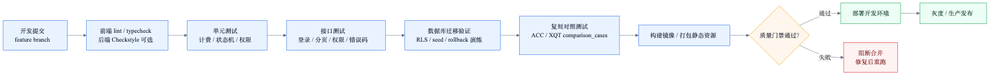

## 源文件

图源文件位于：

```text
docs/assets/engineering/mmd/
```

渲染图片位于：

```text
docs/assets/engineering/
```
