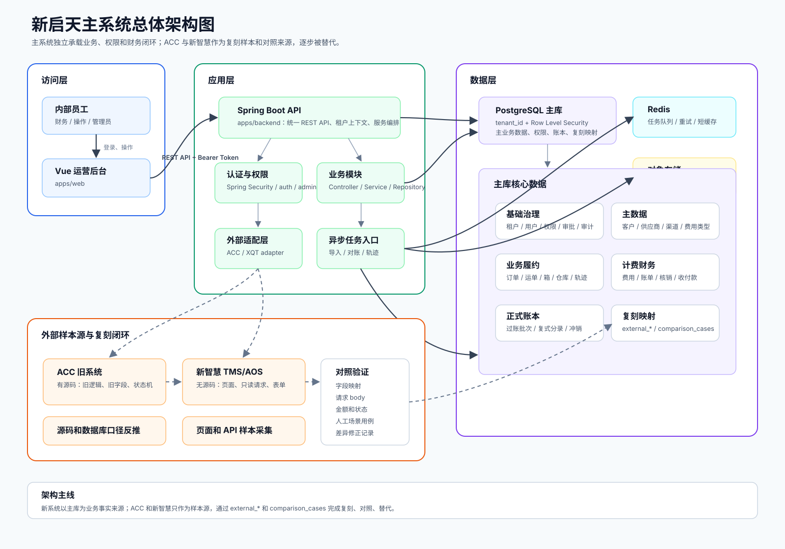
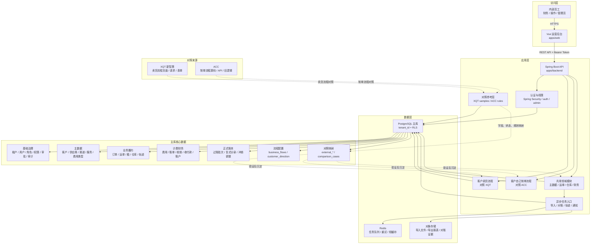

# 新启天主系统总体架构设计

版本：2026-05-07

## 1. 架构定位

新系统的目标不是长期作为 ACC 和新智慧的中间层，也不是简单套壳。它要成为新的主业务系统，拥有自己的账号、权限、流程、数据库、计费规则、财务账本和运营页面。本阶段不再以“复刻 XQT/ACC”为目标，而是从零开发两套客户流程：**客户卖货流程**和**客户自己制单流程**。

ACC 和新智慧在架构中的定位如下：

| 旧系统 | 当前条件 | 在新系统中的作用 | 长期关系 |
| --- | --- | --- | --- |
| 新智慧 XQT | 无源码，有页面和请求样本 | 作为客户卖货流程的页面、筛选、仓配、财务和账单对照样本 | 只做参考，不作为运行依赖 |
| ACC | 有源码 | 作为客户自己制单流程的下单、面单、轨迹、余额和费用对照样本 | 只做参考，不作为运行依赖 |
| 新系统 | 已有代码和数据库底座 | 统一业务入口、统一主数据库、统一权限和财务闭环 | 目标主系统 |

核心结论：

1. 新系统上线后，业务数据应以主库为准。
2. XQT 只对照客户卖货流程，ACC 只对照客户自己制单流程。
3. ACC 和新智慧只作为对照来源，不作为长期运行依赖。
4. 没有历史数据接入时，通过双系统人工对照、页面字段采集、接口样本和对照用例逐步验证新流程口径。

## 2. 总体目标

### 2.1 业务目标

- 从零开发客户卖货流程，对照 XQT 的页面、筛选、仓配、财务请求和业务口径。
- 从零开发客户自己制单流程，对照 ACC 的 API 下单、面单、轨迹、余额和费用逻辑。
- 把两套流程的共同能力沉淀成统一的订单、运单、仓库、费用、账单、核销、账本模型。
- 针对痛点做提升，包括权限审计、自动对账、费用追溯、财务闭环、状态可解释和人工对照验证。

### 2.2 技术目标

- 采用模块化单体作为 MVP 架构，避免过早拆微服务。
- PostgreSQL 作为主数据库，所有业务表带 `tenant_id`，并用 RLS 做数据库层租户隔离。
- Spring Boot API 提供统一服务层，Vue 管理后台提供主操作入口。
- 通过 `external_*` 表保存外部系统样本、字段映射、对象映射和对照结果，避免外部字段污染主业务模型。
- 财务模型分层：业务费用行、客户账单、供应商账单、收付款、核销、正式账本各自独立。

### 2.3 非目标

- MVP 阶段不直接拆成多服务。
- 不把新智慧作为实时写入目标。
- 不把 ACC 数据库结构照搬成主系统结构。
- 不依赖抓取到的接口直接承载生产写操作。
- 不承诺在未完成对照验证前完全覆盖所有旧系统历史边界条件。

## 3. 架构原则

| 原则 | 说明 |
| --- | --- |
| 主库优先 | 新系统业务状态以 PostgreSQL 主库为准 |
| 租户隔离 | 所有业务表带 `tenant_id`，数据库启用 RLS |
| 模块化单体 | 先清晰划分模块边界，再根据压力和团队规模拆分 |
| 对照样本隔离 | ACC/XQT 字段进入 `external_*` 映射层，不直接侵入核心表 |
| 财务分层 | `charges` 不等于账单，账单不等于正式账本 |
| 可追溯 | 费用、审核、核销、过账、外部请求样本都保留证据 |
| 可对照 | 两套流程必须能按页面、接口、字段、金额、状态做差异检查 |
| 可替换 | ACC/XQT 对照层只服务验证，主系统模块完成后逐步归档 |

## 4. 总体架构图



PDF 版本：[system-architecture.pdf](assets/system-architecture.pdf)



## 5. 运行组件

| 组件 | 路径 | 技术 | 职责 |
| --- | --- | --- | --- |
| Web 前端 | `apps/web` | Vue 3, Vite | 登录、运营后台、财务/订单/系统页面 |
| API 服务 | `apps/backend` | Java 17, Spring Boot | 统一 REST API、认证、权限、业务查询 |
| 旧 API 原型 | `apps/api` | Fastify, TypeScript | 前期验证用，后续由 Spring Boot 逐步替代 |
| 共享包 | `packages/shared` | TypeScript | 前后端共享枚举和类型 |
| 主数据库 | `db/migrations`, `db/seeds` | PostgreSQL 16 | 主业务数据、RLS、账本、权限、外部映射 |
| 缓存和任务 | `infra/docker-compose.yml` | Redis 7 | 后台任务、导入、重试、异步对账 |
| ACC 对照层 | `apps/backend/src/main/java/.../reference/acc` | Java/源码阅读/样本录入 | 为客户自己制单流程提供规则和接口对照 |
| XQT 对照层 | `apps/backend/src/main/java/.../reference/xqt` | Java HTTP client/样本录入 | 为客户卖货流程提供页面、字段和财务对照 |

## 6. 代码分层

当前代码按以下层次组织：

```text
apps/web
  src/App.vue
  src/styles.css

apps/api
  src/server.ts
  src/auth.ts
  src/routes/auth.ts
  src/routes/admin.ts
  src/routes/unified-orders.ts
  src/routes/unified-finance.ts
  src/routes/acc.ts
  src/routes/system.ts
  src/adapters/acc-adapter.ts
  src/adapters/xqt-adapter.ts
  src/adapters/system-adapter.ts

apps/backend
  pom.xml
  src/main/java/com/xqt/saas
  src/main/resources/application.yml

packages/shared
  src/index.ts

db
  migrations/*.sql
  seeds/*.sql

infra
  docker-compose.yml
```

Spring Boot 目标演进方向：

```text
apps/backend/src/main/java/com/xqt/saas
  auth/
  modules/
    admin/
    business-flows/
    seller/
    document/
    master-data/
    orders/
    warehouse/
    finance/
    reconciliation/
    ledger/
    external-mapping/
  reference/
    acc/
    xqt/
  jobs/
  db/
```

MVP 阶段允许保留 `apps/api` 作为原型和对照，但新后端开发以 `apps/backend` 的 Spring Boot 模块化单体为准。

## 7. 领域模块

### 7.1 认证与权限中心

职责：

- 内部员工登录、登出、会话撤销。
- 角色、权限、用户授权。
- 登录审计、操作审计。
- 后续扩展客户门户账号和 API 凭证。

核心表：

- `users`
- `roles`
- `permissions`
- `user_roles`
- `role_permissions`
- `user_sessions`
- `auth_login_events`
- `audit_logs`
- `customer_accounts`
- `api_credentials`

当前接口：

| API | 说明 |
| --- | --- |
| `POST /api/auth/login` | 登录 |
| `GET /api/auth/me` | 当前用户 |
| `POST /api/auth/logout` | 退出登录 |
| `/api/admin/users` | 用户 CRUD，维护角色绑定并记录操作人 |
| `/api/admin/roles` | 角色 CRUD，维护权限绑定并记录操作人 |
| `GET /api/admin/permissions` | 权限列表 |
| `GET /api/admin/audit-logs` | 操作审计日志 |
| `GET /api/business-flows` | 两套业务流程配置 |
| `/api/seller/orders` | 客户卖货订单 CRUD |
| `/api/document/orders` | 客户自己制单订单 CRUD |

### 7.2 主数据中心

职责：

- 客户、供应商、承运商、渠道、服务产品、费用类型统一维护。
- 把 XQT 卖货对照和 ACC 制单对照里的客户、供应商、费用名映射到主系统标准对象。
- 支撑报价、下单、账单和对账。

核心表：

- `customers`
- `partners`
- `partner_accounts`
- `carriers`
- `channels`
- `services`
- `service_channel_links`
- `charge_items`
- `customer_contacts`
- `customer_settlement_profiles`
- `tags`
- `entity_tags`

### 7.3 订单、运单与仓库履约

职责：

- 客户订单、运单、箱、申报、仓库收货、拣货、装车、托盘和扫描事件。
- 支撑客户卖货流程的仓配履约，以及客户自己制单流程的发货履约。
- 形成后续财务计费、对账、利润核算的业务依据。

核心表：

- `orders`
- `order_lines`
- `shipments`
- `shipment_order_links`
- `cartons`
- `declarations`
- `warehouses`
- `addresses`
- `warehouse_receipts`
- `warehouse_receipt_items`
- `picklists`
- `picklist_items`
- `ladings`
- `lading_items`
- `pallets`
- `pallet_items`
- `scan_events`

当前接口：

| API | 说明 |
| --- | --- |
| `GET /api/orders` | 当前统一订单视图，后续按 `customerDirection` 汇总两套流程 |

目标接口边界：

- `/api/orders/*`
- `/api/seller/*`
- `/api/document/*`
- `/api/shipments/*`
- `/api/cartons/*`
- `/api/warehouses/*`
- `/api/scans/*`

### 7.4 计费与规则引擎

职责：

- 管理客户价、供应商成本价、附加费、燃油、偏远、低消、分抛、敏感品等规则。
- 根据订单、箱、渠道、客户合同和规则版本生成标准费用行。
- 保留规则快照，支持月底复盘。

核心表：

- `contracts`
- `rate_cards`
- `rate_card_lines`
- `rule_versions`
- `charge_rules`
- `fuel_surcharge_rates`
- `remote_zones`
- `charges`
- `charge_audit_events`
- `charge_adjustments`
- `shipment_charge_snapshots`

关键原则：

1. `charges` 是业务费用行，不是正式账本。
2. 每条费用要能追溯来源、规则、操作人和外部样本。
3. 改价、冲销、补收必须进入审批和审计。

### 7.5 财务中心

职责：

- 客户应收、供应商应付、收付款、核销、发票、账户流水、利润快照。
- 支撑两套流程共用财务中心；卖货流程对照 XQT 财务页面，制单流程对照 ACC 费用和余额口径。
- 在业务费用和正式账本之间建立清晰边界。

核心表：

- `customer_invoices`
- `customer_invoice_lines`
- `payments`
- `receivable_settlements`
- `receivable_settlement_lines`
- `partner_invoices`
- `partner_invoice_lines`
- `partner_payments`
- `payable_settlements`
- `payable_settlement_lines`
- `tax_invoices`
- `financial_accounts`
- `financial_account_records`
- `profit_snapshots`

当前接口：

| API | 说明 |
| --- | --- |
| `GET /api/finance/dashboard` | 卖货流程、制单流程、本地财务汇总视图 |
| `GET /api/finance/overview` | 本地财务概览 |
| `GET /api/finance/branches` | 分公司列表 |
| `GET /api/finance/painpoint-map` | 痛点覆盖映射 |

目标接口边界：

- `/api/finance/receivables/*`
- `/api/finance/payables/*`
- `/api/finance/accounts/*`
- `/api/finance/settlements/*`
- `/api/finance/tax-invoices/*`
- `/api/finance/profit/*`

### 7.6 对账与账本

职责：

- 导入供应商账单和渠道账单。
- 自动匹配费用行、运单、追踪号、客户参考号和金额。
- 差异进入人工处理。
- 正式财务结果进入不可变复式账本。

核心表：

- `carrier_bill_imports`
- `carrier_bill_lines`
- `fee_mapping_dictionary`
- `reconciliation_results`
- `reconciliation_cases`
- `ledger_accounts`
- `ledger_transactions`
- `ledger_entries`
- `posting_batches`

关键原则：

1. 对账结果可以修正，正式账本不可直接修改。
2. 已过账数据只能通过冲销或调整分录处理。
3. 导入文件和导入行必须具备幂等键，避免重复入账。

### 7.7 外部对照中心

职责：

- 保存 XQT 和 ACC 对照来源定义。
- 保存页面/API 模块、字段映射、请求样本、响应结构。
- 保存主系统对象和外部对象的映射关系。
- 保存人工对照用例和对照结果。

核心表：

- `external_systems`
- `external_modules`
- `external_field_mappings`
- `external_object_refs`
- `external_payload_snapshots`
- `comparison_cases`

对照策略：

| 来源 | 方法 | 产物 |
| --- | --- | --- |
| XQT 页面/API | 页面观察、表单字段记录、只读请求抓取 | 客户卖货流程的页面、筛选、仓配和财务口径对照 |
| ACC 源码/API | 读源码、读 SQL、读业务条件、读旧 API body | 客户自己制单流程的下单、面单、轨迹、余额和费用对照 |
| 双系统对照 | 同一业务在旧系统和新系统分别操作 | `comparison_cases`、差异清单、修正记录 |

安全要求：

- XQT 采集阶段只做读取和页面观察。
- 不提交、不保存、不修改 XQT 生产数据。
- 外部系统真实账号、密码、Cookie 不进入代码库。

### 7.8 异步任务与幂等

职责：

- 账单导入、对账、批量计算、轨迹同步、保险回调、通知等异步流程。
- 任务重试、失败记录、死信和幂等控制。

核心表：

- `background_jobs`
- `background_job_attempts`
- `idempotency_keys`
- `import_file_fingerprints`

目标运行方式：

```text
API 写入 background_jobs
  -> Redis 队列唤醒 worker
  -> worker 设置 tenant context
  -> 执行业务任务
  -> 写入结果、尝试记录、审计日志
```

## 8. 数据架构

### 8.1 数据分层

| 层级 | 数据 | 说明 |
| --- | --- | --- |
| 租户层 | `tenants`, RLS policy | 所有业务数据的隔离边界 |
| 基础层 | 用户、权限、组织、审批、审计 | 平台治理能力 |
| 主数据层 | 客户、供应商、渠道、服务、费用类型 | 业务标准字典 |
| 交易层 | 订单、运单、箱、仓库、轨迹 | 履约事实 |
| 计费层 | 规则、价卡、费用行、费用快照 | 业务金额计算 |
| 财务层 | 账单、收付款、核销、发票 | 财务过程 |
| 账本层 | 交易、分录、过账批次 | 正式不可变账务 |
| 流程层 | `business_flows`, `customer_direction` | 卖货流程和制单流程 |
| 对照层 | `external_*`, `comparison_cases` | XQT/ACC 对照证据 |

### 8.2 租户隔离

数据库隔离策略：

1. 业务表包含 `tenant_id`。
2. 表启用 Row Level Security。
3. API 在事务内设置 `app.current_tenant_id`。
4. RLS policy 使用当前租户设置判断读写权限。
5. 登录、迁移、后台管理等特殊场景使用受控 service role。

### 8.3 主键和编号

- 技术主键统一使用 UUID。
- 业务编号独立保存，例如 `order_no`、`shipment_no`、`invoice_no`、`settlement_no`。
- 外部系统编号进入 `external_object_refs`，或者进入业务表的 `source/external_id` 字段。
- 不使用 ACC 或新智慧的 ID 作为主系统主键。

### 8.4 金额和币种

- 金额字段使用 `numeric`，不使用浮点数。
- 业务费用保留原币。
- 正式账本需支持本位币和原币。
- 汇率、记账汇率、合同汇率要分清来源。

## 9. 核心数据流

### 9.1 登录与权限流

```text
用户输入租户、用户名、密码
  -> POST /api/auth/login
  -> 查询 users、roles、permissions
  -> 校验 password_hash
  -> 写 user_sessions 和 auth_login_events
  -> 返回 signed token
  -> 前端请求携带 Authorization
  -> requireAuth 校验 token 和 session
  -> requirePermission 校验权限码
  -> 业务 SQL 设置 app.current_tenant_id
```

### 9.2 下单到费用流

```text
订单/运单/箱录入
  -> 主数据校验
  -> 风险和渠道规则判断
  -> 费率规则引擎计算
  -> 生成 charges
  -> 锁定费用
  -> 进入客户账单或供应商账单
  -> 收付款和核销
  -> 正式过账到 ledger
```

### 9.3 客户卖货流程，对照 XQT

```text
卖货客户创建订单或发货计划
  -> 仓库收货 / 拣货 / 装箱 / 出库
  -> 运单和箱级履约
  -> 生成客户应收、供应商应付和利润快照
  -> 客户账单、供应商账单、核销、过账
  -> 通过 XQT 页面字段和只读请求做人工对照
  -> comparison_cases 记录差异和修正
```

XQT 对照资料流：

```text
XQT 页面观察和只读请求采集
  -> external_modules 登记页面和接口
  -> external_payload_snapshots 保存脱敏样本
  -> external_field_mappings 建立字段映射
  -> 主系统实现卖货流程表单、列表和查询
  -> comparison_cases 人工对照
  -> 差异修正
  -> 主系统卖货流程成为正式入口
```

### 9.4 客户自己制单流程，对照 ACC

```text
客户 API 下单 / 批量导入 / 内部快速制单
  -> 校验客户、服务、地址、申报和风控
  -> 运费试算和余额校验
  -> 生成订单、运单、箱和面单
  -> 轨迹查询和状态回传
  -> 预扣费、充值、账单和核销
  -> 通过 ACC 源码/API body/状态码做人工对照
  -> comparison_cases 记录差异和修正
```

ACC 对照资料流：

```text
阅读 ACC 源码和旧 API
  -> 识别下单、面单、轨迹、余额、费用规则
  -> 建立主系统字段和规则映射
  -> 新模块实现制单流程能力
  -> 单据、面单、轨迹和金额对照
  -> ACC 对照层归档
```

## 10. API 架构

### 10.1 当前 API 分组

| 分组 | 路由 | 状态 |
| --- | --- | --- |
| 健康检查 | `/api/health`, `/actuator/health` | Spring Boot 已有 |
| 认证 | `/api/auth/*` | Spring Boot 已有基础登录/登出/当前用户 |
| 管理 | `/api/admin/*` | Spring Boot 已有用户/角色/权限查询 |
| 统一订单 | `/api/orders` | 当前 Fastify 原型已有，待迁入 Spring Boot |
| 统一财务 | `/api/finance/*` | 当前 Fastify 原型已有，待迁入 Spring Boot |
| ACC 对照 | `/api/acc/*` | 当前 Fastify 原型已有，仅作为制单流程对照 |
| 系统兼容 | `/api/sys/*` | 当前 Fastify 原型已有，后续按需迁移 |

### 10.2 目标 API 分组

| 分组 | 路由前缀 | 说明 |
| --- | --- | --- |
| 基础管理 | `/api/admin/*` | 用户、角色、权限、审计 |
| 业务流程 | `/api/business-flows/*` | 卖货流程、制单流程、服务模式 |
| 主数据 | `/api/master-data/*` | 客户、供应商、渠道、费用类型 |
| 客户卖货 | `/api/seller/*` | 对照 XQT 的订单、仓配、利润、售后 |
| 客户自己制单 | `/api/document/*` | 对照 ACC 的制单、取号、面单、余额 |
| 客户 API | `/api/customer-api/*` | 制单客户 API 下单、查价、查轨迹 |
| 标签面单 | `/api/labels/*` | 面单生成、换标、下载 |
| 订单运单 | `/api/orders/*`, `/api/shipments/*` | 下单、运单、箱、申报 |
| 仓库 | `/api/warehouse/*` | 收货、拣货、装车、托盘、扫描 |
| 计费 | `/api/rates/*`, `/api/charges/*` | 价卡、规则、费用行 |
| 财务 | `/api/finance/*` | 应收、应付、核销、账户、发票 |
| 对账 | `/api/reconciliation/*` | 导入、匹配、差异处理 |
| 账本 | `/api/ledger/*` | 过账、冲销、分录查询 |
| 外部对照 | `/api/external/*` | 外部模块、字段映射、样本、对照 |
| 任务 | `/api/jobs/*` | 异步任务进度和重试 |

### 10.3 API 规范

建议统一响应格式：

```json
{
  "ok": true,
  "data": {},
  "items": [],
  "page": 1,
  "pageSize": 30,
  "total": 0
}
```

错误响应：

```json
{
  "ok": false,
  "error": "错误说明",
  "code": "BUSINESS_ERROR",
  "details": {}
}
```

写接口要求：

- 必须鉴权。
- 必须校验权限码。
- 必须从 token 写入 `created_by`、`updated_by`、`deleted_by`，并写 `audit_logs`。
- 高风险动作必须生成审批请求。
- 对照阶段不允许向 XQT 提交写请求，ACC 对照也不作为生产写入接口。

## 11. 前端架构

### 11.1 当前形态

当前前端位于 `apps/web`，采用 Vue 3 + Vite。已包含：

- 登录页。
- token 保存。
- 401 自动退出。
- 侧边栏用户信息。
- Dashboard 和系统数据入口。

### 11.2 目标形态

前端按业务工作台划分：

| 区域 | 页面 |
| --- | --- |
| 卖货工作台 | 销售订单、仓配履约、利润、售后、POD、对账 |
| 制单工作台 | API 下单、批量制单、面单、轨迹、余额、账单 |
| 工作台 | 经营概览、待办、异常、审批 |
| 订单运单 | 订单列表、运单审计、箱明细、轨迹 |
| 仓库 | 收货、扫描、拣货、装车、托盘 |
| 财务 | 财务流水、客户账单、供应商账单、账户流水、核销 |
| 对账 | 导入、字段映射、自动匹配、差异处理 |
| 主数据 | 客户、供应商、服务、渠道、费用类型 |
| 系统管理 | 用户、角色、权限、审计 |
| 对照中心 | XQT 卖货对照、ACC 制单对照、字段映射、请求样本、对照用例 |

### 11.3 对照页面开发要求

1. 卖货流程页面以 XQT 为对照，先实现主系统标准列表、筛选、分页、排序和列字段。
2. 制单流程页面以 ACC 为对照，先实现下单、面单、轨迹、余额和费用关键路径。
3. 每个对照 POST 请求的 body 必须有字段说明、默认值、枚举值和来源。
4. 页面显示字段和 API 字段必须进入字段映射表。
5. 开发完成后用同一业务场景做对照验证。

## 12. 安全架构

### 12.1 认证

- 内部账号使用 `users`。
- 密码使用 PBKDF2 SHA-256 哈希存储。
- token 带过期时间和 `jti`。
- `user_sessions` 支持主动撤销。
- `auth_login_events` 记录成功和失败登录。

### 12.2 授权

- 权限码采用 `domain.resource.action` 格式。
- 角色通过 `role_permissions` 绑定权限。
- 用户通过 `user_roles` 绑定角色。
- 后续可按分公司、客户、部门扩展授权范围。

### 12.3 数据隔离

- PostgreSQL RLS 是底线。
- API 不允许只依赖前端菜单控制权限。
- 外部系统样本必须脱敏。
- 生产 Cookie、密码、token、API secret 不进入 Git。

### 12.4 审批和审计

必须审计的动作：

- 创建、修改、禁用用户。
- 角色和权限变更。
- 改价、调账、冲销、核销。
- 账单确认、取消确认。
- 正式过账和冲销。
- 外部样本采集和字段映射确认。

## 13. 部署架构

### 13.1 本地开发

当前本地开发由 `infra/docker-compose.yml` 提供：

| 服务 | 默认端口 | 说明 |
| --- | --- | --- |
| PostgreSQL | `15432` | 主数据库 |
| Redis | `6379` | 缓存和任务 |
| API | `8080` | Spring Boot 服务 |
| 旧 API 原型 | `8080` | Fastify 服务，迁移期按需启动 |
| Web | `5173` | Vite 开发服务 |

常用流程：

```bash
docker compose -f infra/docker-compose.yml up -d
npm install
npm run build
cd apps/backend && ./mvnw test
npm run dev
```

### 13.2 生产目标

```text
CDN / 静态资源服务
  -> Web dist

负载均衡
  -> Spring Boot API 实例
  -> Spring Boot Worker 实例

托管 PostgreSQL
  -> 主库
  -> 自动备份
  -> PITR

Redis
  -> 队列
  -> 短缓存

对象存储
  -> 导入文件
  -> 导出报表
  -> 对账证据

日志和监控
  -> 应用日志
  -> API 指标
  -> 任务失败告警
```

生产环境建议：

- API 和 Worker 分进程部署。
- 数据库开启自动备份和恢复演练。
- 文件导入原件放对象存储，不直接塞数据库。
- 所有环境变量由密钥管理系统注入。
- 默认管理员首次登录强制改密。

## 14. 可观测性

MVP 阶段至少需要：

- API 请求日志。
- 登录和操作审计。
- 后台任务状态。
- 导入文件指纹。
- 对账差异统计。
- 数据库慢查询记录。

生产阶段建议补：

- OpenTelemetry trace。
- Prometheus 指标。
- 错误告警。
- 每日任务失败汇总。
- 财务关键数据一致性巡检。

关键巡检指标：

| 指标 | 说明 |
| --- | --- |
| 未过账账单数 | 已确认但未进入账本的账单 |
| 核销差额 | 收付款和账单核销金额差异 |
| 对账失败率 | 渠道账单匹配失败比例 |
| 重复导入数 | 同一文件或同一账单行重复导入 |
| RLS 违规错误 | 租户上下文缺失或越权请求 |

## 15. 当前实现状态

已完成：

| 类别 | 内容 |
| --- | --- |
| 数据库 | `001` 到 `013` 迁移，`001` 到 `007` 种子 |
| 多租户 | `tenant_id`、RLS、租户上下文 |
| 财务底座 | 费用、账单、对账、账本、财务账户相关表 |
| 两套流程底座 | `business_flows`, `customer_direction`, `service_mode` |
| 对照底座 | `external_systems`, `external_modules`, `external_field_mappings`, `external_payload_snapshots`, `comparison_cases` |
| 登录权限 | Spring Boot 已实现登录、登出、session、角色、权限、管理员查询接口 |
| 前端 | 登录页、token 请求、用户信息、退出登录 |
| 文档 | 数据库设计、权限架构、新智慧请求、周计划 |

当前仍需补齐：

| 类别 | 待完成 |
| --- | --- |
| 业务 CRUD | 主数据、订单、仓库、财务模块完整增删改查 |
| 卖货流程 | 订单、仓配、财务、售后、利润页面和 API |
| 制单流程 | API 下单、批量制单、面单、轨迹、余额、费用 API |
| 对照体系 | `comparison_cases` 的实际用例录入和差异追踪 |
| 任务 Worker | 导入、对账、轨迹等异步任务执行器 |
| 菜单权限 | 前端按权限动态显示菜单和按钮 |
| 测试体系 | 单元测试、接口测试、对照测试、回归测试 |

## 16. 三阶段演进路线

### 阶段 1：客户卖货流程，对照 XQT

目标：

- 登录权限可用。
- 主数据库结构稳定。
- 卖货订单、仓配履约、财务流水、客户账单、供应商账单、账户流水进入主库。
- XQT 页面字段、筛选、POST body 作为对照，不作为运行依赖。

验收：

- 同一卖货财务查询在 XQT 和新系统字段可解释对齐。
- 同一账单样本金额一致。
- 不需要提交 XQT 写请求。

### 阶段 2：客户自己制单流程，对照 ACC

目标：

- 制单订单、客户 API 下单、运费试算、面单、轨迹、余额、费用进入主系统。
- 订单、运单、箱、标签、轨迹页面可用。
- 新系统可以独立创建和维护业务单据。

验收：

- 典型 ACC 制单业务场景在新系统跑通。
- 费用、面单、轨迹和 ACC 旧逻辑可解释对齐。
- 差异能定位到规则、字段或状态。

### 阶段 3：替换旧系统和流程提升

目标：

- 新系统作为日常主入口。
- ACC 和新智慧降级为历史对照或只读归档。
- 财务过账、审批、审计、对账异常处理完整闭环。

验收：

- 新业务不再依赖 ACC 或新智慧创建。
- 财务闭环可从运单追溯到费用、账单、核销和账本。
- 权限、审计、备份、监控达到生产要求。

## 17. 关键风险和控制

| 风险 | 表现 | 控制方式 |
| --- | --- | --- |
| XQT 无源码 | 卖货流程页面逻辑和接口含隐藏规则 | 只读请求采集、表单对照、人工场景验证 |
| 无历史数据接入 | 很难一次性证明完全一致 | 双系统同场景操作，建立 `comparison_cases` |
| ACC 逻辑复杂 | 旧代码里隐藏制单、面单、余额边界条件 | 按模块阅读源码，抽出规则清单和测试样本 |
| 财务口径不清 | 金额、状态、核销对不上 | 费用、账单、核销、账本分层，逐层对照 |
| 权限遗漏 | 越权修改财务数据 | 权限码、审批、审计、RLS 四层控制 |
| 外部账号泄露 | Cookie、密码进入仓库 | 禁止提交真实凭证，样本脱敏 |
| 过早复杂化 | 微服务和中台拖慢交付 | MVP 采用模块化单体，边界清晰后再拆 |

## 18. 架构验收标准

系统架构达到可上线条件，需要满足：

1. 主流程不依赖 ACC 或新智慧写操作。
2. 新系统账号和权限独立可用。
3. 所有核心业务表受 RLS 保护。
4. 客户卖货流程至少有 XQT 字段映射、请求 body、对照用例。
5. 客户自己制单流程至少有 ACC 核心计费、面单、轨迹、状态测试样本。
6. 财务数据能从运单追溯到费用、账单、核销和账本。
7. 高风险操作有权限、审批和审计。
8. 导入和对账任务具备幂等和失败重试。
9. 默认密码、外部账号、Cookie、API secret 不进入代码仓库。
10. 构建、迁移、种子、基础接口验证可以重复执行。
