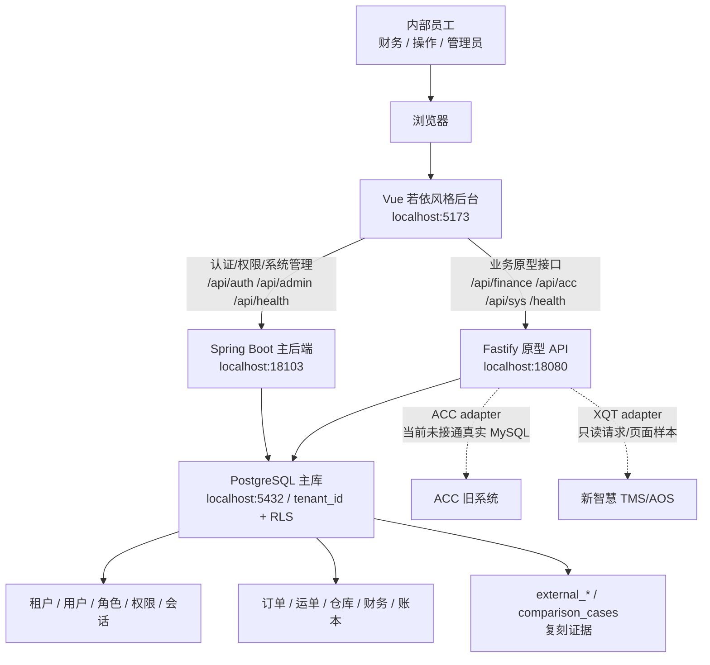
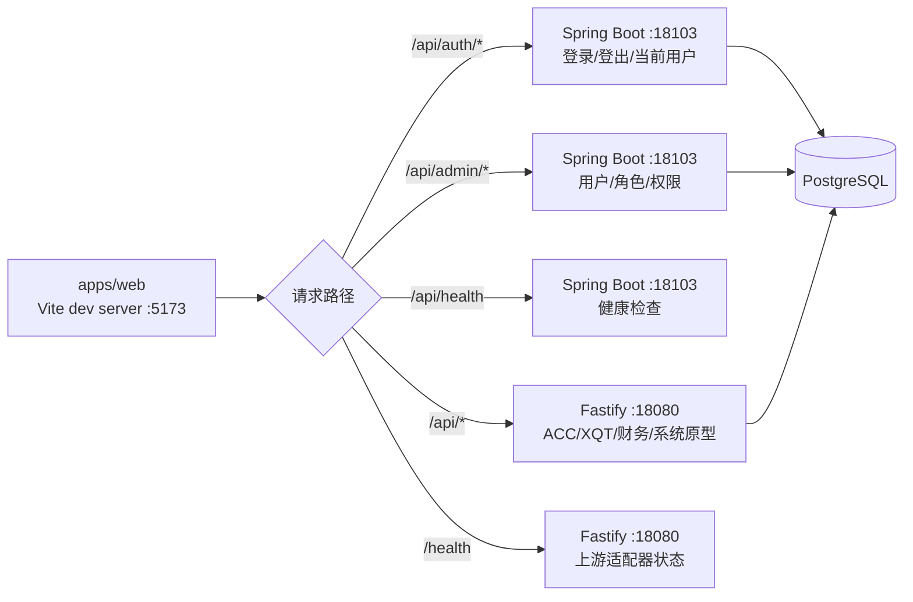
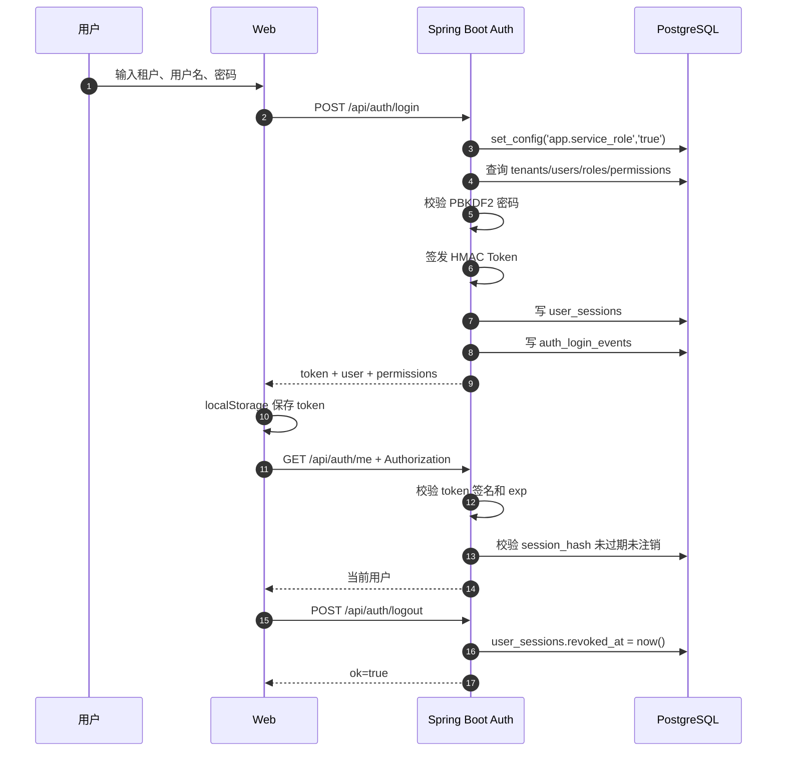
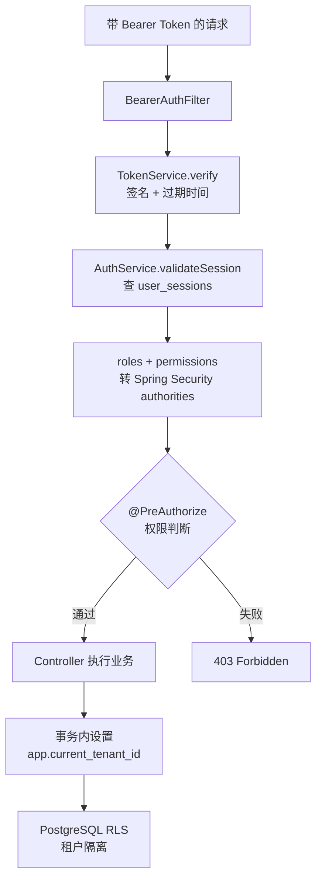
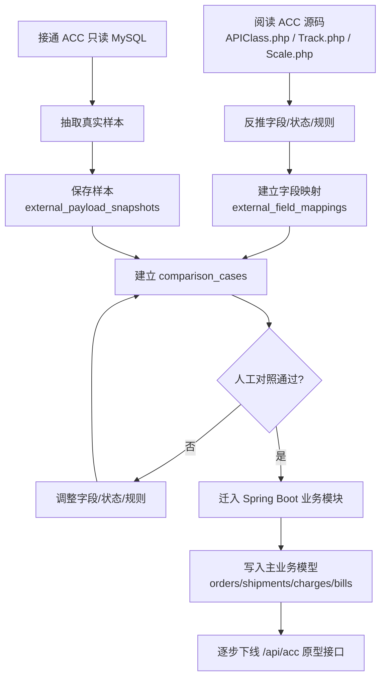
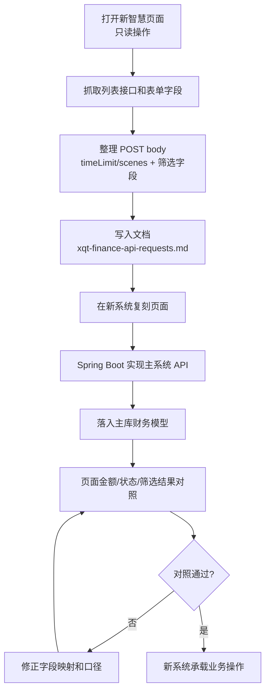
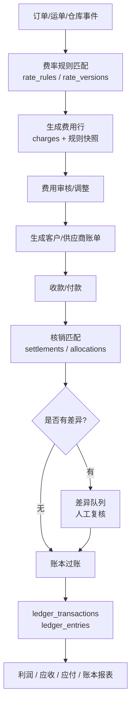
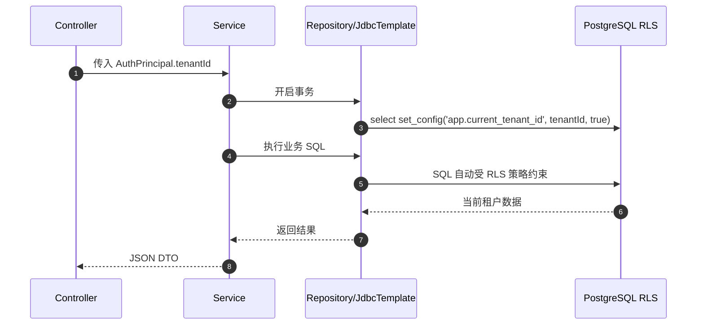
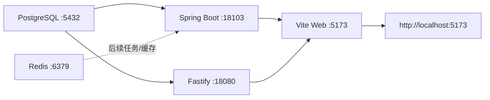

# 系统流程图

版本：2026-05-06

## 1. 总体访问流程

## 2. 前端路由与代理流程

## 3. 登录与会话流程

## 4. 权限校验流程

## 5. ACC 复刻流程

## 6. 新智慧复刻流程

## 7. 财务闭环流程

## 8. 数据写入与租户隔离流程

## 9. 本地启动流程

当前后台会话：

| 会话 | 服务 | 地址 |
| --- | --- | --- |
| `xqt-web-5173` | Web 前端 | `http://localhost:5173` |
| `xqt-backend-18103` | Spring Boot 后端 | `http://localhost:18103` |

