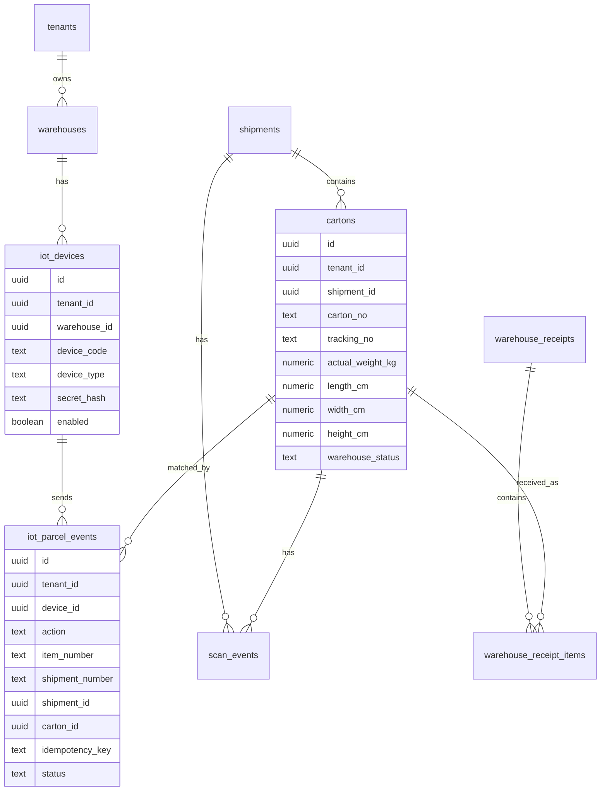

# 仓库 IoT 数据接入数据库设计修改方案

> 版本：2026-05-28  
> 项目：`xqt-saas`  
> 目标：在现有仓配数据库基础上，支持仓库设备、DWS、流水线、分拣机向系统推送箱级收货、称重、量方、图片、打印与异常数据。

---

## 1. 总体结论

当前系统已经具备箱级仓配履约基础，核心表包括：

- `warehouses`
- `shipments`
- `cartons`
- `warehouse_receipts`
- `warehouse_receipt_items`
- `picklists`
- `picklist_items`
- `ladings`
- `lading_items`
- `pallets`
- `pallet_items`
- `scan_events`
- `tracking_events`

因此本次不建议重建一套独立 WMS 表，而是在现有“运单 + 箱 + 仓配履约 + 扫描事件”模型上补齐 IoT 接入能力。

本次数据库修改建议分为三类：

1. **补充现有业务表字段**：让 `cartons` 能承接 IoT 设备回传的收货、称重、量方、图片、设备信息。
2. **新增 IoT 设备与事件表**：管理设备密钥、IP 白名单、推送日志、幂等、防重放和异常排查。
3. **补充索引、唯一约束与状态映射**：保证高频扫码场景下查询快、重复推送不重复写业务结果。

---

## 2. 设计原则

### 2.1 外部仓库不直连数据库

仓库、DWS、流水线、分拣机只调用统一 API：

```http
POST /api/iot/warehouse/parcel
```

数据库只由后端服务写入，避免外部系统绕过租户隔离、权限校验、幂等判断和业务状态机。

### 2.2 原始事件和业务状态分离

每次设备推送都应该记录原始事件，但业务表只保留当前有效状态。

- 原始事件：写入 `iot_parcel_events`，必要时同步写 `scan_events`。
- 当前业务状态：更新 `cartons`、`shipments`、`warehouse_receipt_items`、`picklist_items` 等。

这样做的好处是：

- 设备重复推送可以追溯。
- 业务表不会被重复数据污染。
- 以后排查设备、接口、重量差异、标签打印失败有完整证据。

### 2.3 以箱号为主，运单号辅助校验

仓库设备通常扫描箱号，因此系统应以 `cartons.carton_no` 作为第一识别字段。

推荐匹配顺序：

1. `tenant_id + carton_no`
2. 如果传了 `shipment_number`，再校验 `cartons.shipment_id -> shipments.shipment_no`
3. 如果设备扫的是面单号，则可用 `cartons.tracking_no` 兜底匹配

### 2.4 幂等优先

IoT 场景会出现重复扫码、设备重试、网络超时后重发。数据库层必须支持幂等。

建议幂等键：

```text
tenant_id + device_code + action + item_number + event_time_or_external_event_id
```

如果仓库设备能提供唯一事件号，优先使用：

```text
external_event_id
```

如果设备不能提供，则后端生成：

```text
md5(device_code + action + item_number + time)
```

---

## 3. 本次数据库变更范围

### 3.1 新增表

| 表名 | 用途 | 优先级 |
|---|---|---|
| `iot_devices` | 仓库设备/DWS/流水线/分拣机主数据与密钥管理 | P0 |
| `iot_parcel_events` | 设备推送事件日志、幂等、防重放、异常排查 | P0 |
| `iot_device_ip_allowlist` | 设备 IP 白名单，若先简化可放入 `iot_devices.ip_allowlist` JSONB | P1 |

### 3.2 修改现有表

| 表名 | 修改内容 | 优先级 |
|---|---|---|
| `cartons` | 补 IoT 收货、称重、量方、图片、设备字段 | P0 |
| `shipments` | 可选补 `last_warehouse_event_at`、`warehouse_status` | P1 |
| `warehouse_receipt_items` | 可选补 `iot_event_id`、`device_code` | P1 |
| `scan_events` | 可选补 `iot_event_id`、`idempotency_key` | P1 |

### 3.3 不建议本次新增

暂不建议立即新增完整 SKU 库存表，例如：

- `inventory_items`
- `stock_ledgers`
- `warehouse_locations`
- `stock_batches`

原因是当前业务模型是箱级履约，不是 SKU 级 WMS。先把箱级 IoT 接入跑通，再根据真实需求补库存账。

---

## 4. 表设计详情

## 4.1 新增表：`iot_devices`

### 用途

管理外部仓库设备，包括 DWS、流水线、PDA、扫码枪、分拣机、称重设备等。

### 建议字段

| 字段 | 类型 | 说明 |
|---|---|---|
| `id` | `uuid` | 主键 |
| `tenant_id` | `uuid` | 租户 |
| `warehouse_id` | `uuid` | 归属仓库，可为空 |
| `device_code` | `text` | 设备编号，外部请求必传 |
| `device_name` | `text` | 设备名称 |
| `device_type` | `text` | `DWS` / `PDA` / `SCANNER` / `SORTER` / `CONVEYOR` / `OTHER` |
| `secret_hash` | `text` | 设备密钥哈希，不存明文 |
| `secret_last_rotated_at` | `timestamptz` | 密钥最近轮换时间 |
| `ip_allowlist` | `jsonb` | 简化版 IP 白名单 |
| `enabled` | `boolean` | 是否启用 |
| `last_seen_at` | `timestamptz` | 最近调用时间 |
| `metadata` | `jsonb` | 设备扩展信息 |
| `created_at` | `timestamptz` | 创建时间 |
| `updated_at` | `timestamptz` | 更新时间 |

### 建议约束

- `unique (tenant_id, device_code)`
- `device_type` 使用 check 约束限制枚举值
- `enabled` 默认 `true`

### 建议 DDL

```sql
create table iot_devices (
  id uuid primary key default gen_random_uuid(),
  tenant_id uuid not null references tenants(id),
  warehouse_id uuid references warehouses(id),
  device_code text not null,
  device_name text not null,
  device_type text not null default 'OTHER'
    check (device_type in ('DWS', 'PDA', 'SCANNER', 'SORTER', 'CONVEYOR', 'OTHER')),
  secret_hash text not null,
  secret_last_rotated_at timestamptz,
  ip_allowlist jsonb not null default '[]',
  enabled boolean not null default true,
  last_seen_at timestamptz,
  metadata jsonb not null default '{}',
  created_at timestamptz not null default now(),
  updated_at timestamptz not null default now(),
  unique (tenant_id, device_code)
);

create index idx_iot_devices_warehouse on iot_devices(tenant_id, warehouse_id);
create index idx_iot_devices_enabled on iot_devices(tenant_id, enabled);
```

---

## 4.2 新增表：`iot_parcel_events`

### 用途

记录每次仓库设备推送请求及处理结果。它是本次设计的核心审计表。

### 建议字段

| 字段 | 类型 | 说明 |
|---|---|---|
| `id` | `uuid` | 主键 |
| `tenant_id` | `uuid` | 租户 |
| `warehouse_id` | `uuid` | 仓库 |
| `device_id` | `uuid` | 设备表主键 |
| `device_code` | `text` | 冗余设备编号，便于排查 |
| `action` | `text` | `check` / `pickup` / `update` / `exception` |
| `event_time` | `timestamptz` | 设备事件时间 |
| `received_at` | `timestamptz` | 系统接收时间 |
| `item_number` | `text` | 设备传入箱号 |
| `shipment_number` | `text` | 设备传入运单号 |
| `shipment_id` | `uuid` | 匹配到的运单 |
| `carton_id` | `uuid` | 匹配到的箱 |
| `tracking_no` | `text` | 面单/跟踪号 |
| `weight_kg` | `numeric(10,3)` | 设备回传重量 |
| `length_cm` | `numeric(10,2)` | 长 |
| `width_cm` | `numeric(10,2)` | 宽 |
| `height_cm` | `numeric(10,2)` | 高 |
| `cbm` | `numeric(10,4)` | 体积，可计算 |
| `pic_url` | `text` | 图片 URL |
| `idempotency_key` | `text` | 幂等键 |
| `request_token` | `text` | 请求 token，建议只存摘要 |
| `request_ip` | `inet` | 请求 IP |
| `raw_request_json` | `jsonb` | 原始请求 |
| `response_json` | `jsonb` | 返回给设备的响应 |
| `status` | `text` | `RECEIVED` / `PROCESSED` / `DUPLICATE` / `FAILED` / `IGNORED` |
| `error_code` | `text` | 内部错误码 |
| `error_message` | `text` | 内部错误详情 |
| `created_at` | `timestamptz` | 创建时间 |

### 建议约束

- `unique (tenant_id, idempotency_key)`
- `action` check 约束
- `status` check 约束

### 建议 DDL

```sql
create table iot_parcel_events (
  id uuid primary key default gen_random_uuid(),
  tenant_id uuid not null references tenants(id),
  warehouse_id uuid references warehouses(id),
  device_id uuid references iot_devices(id),
  device_code text,
  action text not null
    check (action in ('check', 'pickup', 'update', 'exception')),
  event_time timestamptz,
  received_at timestamptz not null default now(),
  item_number text not null,
  shipment_number text,
  shipment_id uuid references shipments(id),
  carton_id uuid references cartons(id),
  tracking_no text,
  weight_kg numeric(10,3),
  length_cm numeric(10,2),
  width_cm numeric(10,2),
  height_cm numeric(10,2),
  cbm numeric(10,4),
  pic_url text,
  idempotency_key text not null,
  request_token text,
  request_ip inet,
  raw_request_json jsonb not null default '{}',
  response_json jsonb not null default '{}',
  status text not null default 'RECEIVED'
    check (status in ('RECEIVED', 'PROCESSED', 'DUPLICATE', 'FAILED', 'IGNORED')),
  error_code text,
  error_message text,
  created_at timestamptz not null default now(),
  unique (tenant_id, idempotency_key)
);

create index idx_iot_parcel_events_item on iot_parcel_events(tenant_id, item_number, received_at desc);
create index idx_iot_parcel_events_shipment on iot_parcel_events(tenant_id, shipment_id, received_at desc);
create index idx_iot_parcel_events_carton on iot_parcel_events(tenant_id, carton_id, received_at desc);
create index idx_iot_parcel_events_device on iot_parcel_events(tenant_id, device_code, received_at desc);
create index idx_iot_parcel_events_status on iot_parcel_events(tenant_id, status, received_at desc);
```

---

## 4.3 修改表：`cartons`

### 现状

当前 `cartons` 已有：

- `carton_no`
- `tracking_no`
- `actual_weight_kg`
- `length_cm`
- `width_cm`
- `height_cm`
- `chargeable_weight_kg`
- `chargeable_weight_lb`
- `cbm`
- `oversize_flags`

这些字段已经能承接 IoT 回传的重量尺寸。

### 需要补充

建议补充 IoT 相关状态字段：

| 字段 | 类型 | 说明 |
|---|---|---|
| `picked_at` | `timestamptz` | 首次拣货/收货时间 |
| `measured_at` | `timestamptz` | 最近称重量方时间 |
| `pickup_image_url` | `text` | 收货/拣货图片 |
| `iot_device_code` | `text` | 最近一次写入的设备编号 |
| `last_iot_event_id` | `uuid` | 最近一次 IoT 事件 |
| `warehouse_status` | `text` | 箱在仓状态 |

### `warehouse_status` 建议值

- `CREATED`：箱已创建，未入仓
- `CHECKED`：设备校验通过
- `PICKED`：已收货/已拣货
- `MEASURED`：已称重量方
- `LOADED`：已装车
- `EXCEPTION`：异常

### 建议 DDL

```sql
alter table cartons
  add column if not exists picked_at timestamptz,
  add column if not exists measured_at timestamptz,
  add column if not exists pickup_image_url text,
  add column if not exists iot_device_code text,
  add column if not exists last_iot_event_id uuid references iot_parcel_events(id),
  add column if not exists warehouse_status text not null default 'CREATED'
    check (warehouse_status in ('CREATED', 'CHECKED', 'PICKED', 'MEASURED', 'LOADED', 'EXCEPTION'));

create index if not exists idx_cartons_warehouse_status
  on cartons(tenant_id, warehouse_status);

create index if not exists idx_cartons_iot_device
  on cartons(tenant_id, iot_device_code)
  where iot_device_code is not null;
```

### 更新策略

`pickup`：

- 更新 `actual_weight_kg`
- 更新 `length_cm / width_cm / height_cm`
- 计算 `cbm`
- 写 `picked_at`
- 写 `measured_at`
- 写 `pickup_image_url`
- 写 `iot_device_code`
- 写 `last_iot_event_id`
- `warehouse_status = 'PICKED'` 或 `MEASURED`

`update`：

- 只覆盖传入的重量尺寸/图片字段
- 更新 `measured_at`
- 更新 `last_iot_event_id`
- `warehouse_status = 'MEASURED'`

---

## 4.4 修改表：`shipments`

### 是否必须修改

不是 P0 必须。现有 `shipments` 已有：

- `warehouse_in_at`
- `measured_at`
- `departed_at`

可以承接运单级节点。

### 建议补充

如果要支持运单维度快速看仓内状态，建议补：

| 字段 | 类型 | 说明 |
|---|---|---|
| `warehouse_status` | `text` | 运单仓内状态 |
| `last_warehouse_event_at` | `timestamptz` | 最近仓库事件时间 |
| `received_carton_count` | `int` | 已收/已扫箱数，若担心冗余可不加 |

### 建议 DDL

```sql
alter table shipments
  add column if not exists warehouse_status text,
  add column if not exists last_warehouse_event_at timestamptz,
  add column if not exists received_carton_count int;

create index if not exists idx_shipments_warehouse_status
  on shipments(tenant_id, warehouse_status)
  where warehouse_status is not null;
```

### 是否推荐加 `received_carton_count`

短期可以不加，用 SQL 实时统计：

```sql
select count(*)
from cartons
where tenant_id = ?
  and shipment_id = ?
  and warehouse_status in ('PICKED', 'MEASURED', 'LOADED');
```

如果后续高并发看板需要，可以再加冗余计数字段。

---

## 4.5 修改表：`warehouse_receipt_items`

### 用途

如果仓库收货流程强依赖收货单，则设备 `pickup` 成功后应同步更新收货明细。

### 建议补充

```sql
alter table warehouse_receipt_items
  add column if not exists iot_event_id uuid references iot_parcel_events(id),
  add column if not exists device_code text;

create index if not exists idx_receipt_items_iot_event
  on warehouse_receipt_items(tenant_id, iot_event_id)
  where iot_event_id is not null;
```

### 更新策略

当设备推送 `pickup`：

- 如果存在对应 `warehouse_receipt_items.carton_id`，更新：
  - `scan_status = 'SCANNED'`
  - `weight_kg`
  - `length_cm`
  - `width_cm`
  - `height_cm`
  - `scanned_at`
  - `iot_event_id`
  - `device_code`

如果没有收货单明细，短期可以只更新 `cartons` 和 `scan_events`，后续由业务流程补建收货单。

---

## 4.6 修改表：`scan_events`

### 现状

`scan_events` 已经适合记录仓库扫描：

- `warehouse_id`
- `shipment_id`
- `carton_id`
- `tracking_no`
- `scan_type`
- `scan_result`
- `scanned_at`
- `device_code`
- `raw_payload`

### 建议补充

```sql
alter table scan_events
  add column if not exists iot_event_id uuid references iot_parcel_events(id),
  add column if not exists idempotency_key text;

create index if not exists idx_scan_events_iot_event
  on scan_events(tenant_id, iot_event_id)
  where iot_event_id is not null;

create index if not exists idx_scan_events_idempotency
  on scan_events(tenant_id, idempotency_key)
  where idempotency_key is not null;
```

### `scan_type` 建议值

由于 `scan_type` 当前是 `text`，可以先约定值，不急于加 check：

- `IOT_CHECK`
- `IOT_PICKUP`
- `IOT_UPDATE`
- `IOT_EXCEPTION`
- `WAREHOUSE_RECEIVE`
- `DWS_MEASURE`
- `LABEL_PRINT`
- `LOAD`

---

## 5. 数据写入流程

## 5.1 `action=check`

### 写库建议

`check` 本身不应修改核心业务状态，只记录事件：

1. 校验签名、时间戳、设备状态。
2. 查 `cartons`。
3. 如传 `shipment_number`，校验运单归属。
4. 写 `iot_parcel_events`，状态为：
   - 成功：`PROCESSED`
   - 失败：`FAILED`
   - 重复：`DUPLICATE`
5. 可选写 `scan_events`，`scan_type = 'IOT_CHECK'`。
6. 不更新 `cartons.warehouse_status`，或只在业务需要时更新为 `CHECKED`。

### 推荐

为了避免设备频繁 `check` 造成箱状态被污染，建议 `check` 只写事件，不改箱状态。

---

## 5.2 `action=pickup`

### 写库流程

1. 验签。
2. 校验设备是否启用。
3. 生成或读取 `idempotency_key`。
4. 尝试插入 `iot_parcel_events`。
5. 如果唯一键冲突，读取原事件并返回原响应。
6. 匹配 `cartons` 和 `shipments`。
7. 校验重量尺寸合法性。
8. 更新 `cartons`。
9. 更新 `shipments.warehouse_in_at` 和 `shipments.measured_at`。
10. 更新 `warehouse_receipt_items`，如果存在。
11. 写 `scan_events`。
12. 可选写 `tracking_events`，给客户侧展示“已到仓/已称重”。
13. 更新 `iot_parcel_events.response_json/status`。

### `cartons` 更新示例

```sql
update cartons
set actual_weight_kg = coalesce(:weight_kg, actual_weight_kg),
    length_cm = coalesce(:length_cm, length_cm),
    width_cm = coalesce(:width_cm, width_cm),
    height_cm = coalesce(:height_cm, height_cm),
    cbm = case
      when :length_cm is not null and :width_cm is not null and :height_cm is not null
      then round((:length_cm * :width_cm * :height_cm / 1000000.0)::numeric, 4)
      else cbm
    end,
    picked_at = coalesce(picked_at, now()),
    measured_at = now(),
    pickup_image_url = coalesce(:pic_url, pickup_image_url),
    iot_device_code = :device_code,
    last_iot_event_id = :iot_event_id,
    warehouse_status = 'MEASURED'
where tenant_id = :tenant_id
  and id = :carton_id;
```

---

## 5.3 `action=update`

`update` 用于复称、修正尺寸、补图、补打标签。

### 写库策略

- 仍写 `iot_parcel_events`
- 更新 `cartons` 中传入的字段
- 不重置 `picked_at`
- 更新 `measured_at`
- 写 `scan_events`
- 如果重量尺寸变化影响费用，后续应触发费用重算任务

---

## 6. 幂等、防重放与唯一约束

### 6.1 设备签名

当前设计文档建议：

```text
token = md5(secret + time)
```

这个方案可以用于 Demo 或兼容仓库旧设备，但生产建议升级为：

```text
token = hmac_sha256(secret, device_code + time + action + item_number)
```

如果短期只能使用 md5，应至少做到：

- secret 不入库明文，只保存 hash 或加密密文。
- 请求时间偏差不超过 5 分钟。
- 同一 `idempotency_key` 只能处理一次。
- 生产必须 HTTPS。

### 6.2 幂等键生成

优先级：

1. 设备传 `event_id`：`device_code + event_id`
2. 否则：`device_code + action + item_number + time`
3. 再兜底：`token + time + item_number + action`

### 6.3 数据库唯一约束

`iot_parcel_events` 必须有：

```sql
unique (tenant_id, idempotency_key)
```

这样应用层即使并发收到两次相同请求，数据库也能兜底防重。

---

## 7. RLS 与租户隔离

新增表必须开启 RLS，与现有迁移风格一致。

```sql
alter table iot_devices enable row level security;
alter table iot_devices force row level security;
create policy iot_devices_tenant_isolation on iot_devices
  using (app_tenant_matches(tenant_id))
  with check (app_tenant_matches(tenant_id));

alter table iot_parcel_events enable row level security;
alter table iot_parcel_events force row level security;
create policy iot_parcel_events_tenant_isolation on iot_parcel_events
  using (app_tenant_matches(tenant_id))
  with check (app_tenant_matches(tenant_id));
```

IoT 外部接口不是用户登录态，需要后端在处理请求时根据设备解析出 `tenant_id`，并设置：

```sql
set local app.current_tenant_id = '<tenant_id>';
```

否则 RLS 会挡住查询和写入。

---

## 8. 与现有表的关系图



---

## 9. 仓库方字段对接规范

### 9.1 仓库必须传

| 字段 | 是否必填 | 说明 |
|---|---|---|
| `action` | 是 | `check` / `pickup` / `update` |
| `device_code` | 是 | 设备编号 |
| `item_number` | 是 | 箱号，优先对应 `cartons.carton_no` |
| `time` | 是 | Unix 时间戳 |
| `token` | 是 | 签名 |

### 9.2 推荐传

| 字段 | 说明 |
|---|---|
| `shipment_number` | 运单号，对应 `shipments.shipment_no` |
| `warehouse_code` | 仓库代码，对应 `warehouses.code` |
| `event_id` | 仓库侧唯一事件号 |
| `weight` | kg |
| `length` | cm |
| `width` | cm |
| `height` | cm |
| `pic_url` | 图片 URL |

### 9.3 不推荐长期传

| 字段 | 原因 |
|---|---|
| `pic_base64` | 请求体过大，影响网关、日志、数据库和接口稳定性 |
| 大段设备日志 | 应保存在仓库设备平台或对象存储，系统只存 URL/摘要 |

---

## 10. 迁移文件建议

当前已有 `036_acc_currency_fields.sql`，所以不要再使用 `036_ai_iot_new_modules.sql`。

建议新增：

```text
db/migrations/037_warehouse_iot_schema.sql
```

建议包含：

1. 创建 `iot_devices`
2. 创建 `iot_parcel_events`
3. 修改 `cartons`
4. 修改 `warehouse_receipt_items`
5. 修改 `scan_events`
6. 可选修改 `shipments`
7. 创建索引
8. 开启 RLS 并创建 policy

---

## 11. 完整迁移草案

```sql
-- 037: 仓库 IoT 设备与箱级事件接入

create table if not exists iot_devices (
  id uuid primary key default gen_random_uuid(),
  tenant_id uuid not null references tenants(id),
  warehouse_id uuid references warehouses(id),
  device_code text not null,
  device_name text not null,
  device_type text not null default 'OTHER'
    check (device_type in ('DWS', 'PDA', 'SCANNER', 'SORTER', 'CONVEYOR', 'OTHER')),
  secret_hash text not null,
  secret_last_rotated_at timestamptz,
  ip_allowlist jsonb not null default '[]',
  enabled boolean not null default true,
  last_seen_at timestamptz,
  metadata jsonb not null default '{}',
  created_at timestamptz not null default now(),
  updated_at timestamptz not null default now(),
  unique (tenant_id, device_code)
);

create table if not exists iot_parcel_events (
  id uuid primary key default gen_random_uuid(),
  tenant_id uuid not null references tenants(id),
  warehouse_id uuid references warehouses(id),
  device_id uuid references iot_devices(id),
  device_code text,
  action text not null
    check (action in ('check', 'pickup', 'update', 'exception')),
  event_time timestamptz,
  received_at timestamptz not null default now(),
  item_number text not null,
  shipment_number text,
  shipment_id uuid references shipments(id),
  carton_id uuid references cartons(id),
  tracking_no text,
  weight_kg numeric(10,3),
  length_cm numeric(10,2),
  width_cm numeric(10,2),
  height_cm numeric(10,2),
  cbm numeric(10,4),
  pic_url text,
  idempotency_key text not null,
  request_token text,
  request_ip inet,
  raw_request_json jsonb not null default '{}',
  response_json jsonb not null default '{}',
  status text not null default 'RECEIVED'
    check (status in ('RECEIVED', 'PROCESSED', 'DUPLICATE', 'FAILED', 'IGNORED')),
  error_code text,
  error_message text,
  created_at timestamptz not null default now(),
  unique (tenant_id, idempotency_key)
);

alter table cartons
  add column if not exists picked_at timestamptz,
  add column if not exists measured_at timestamptz,
  add column if not exists pickup_image_url text,
  add column if not exists iot_device_code text,
  add column if not exists last_iot_event_id uuid references iot_parcel_events(id),
  add column if not exists warehouse_status text not null default 'CREATED'
    check (warehouse_status in ('CREATED', 'CHECKED', 'PICKED', 'MEASURED', 'LOADED', 'EXCEPTION'));

alter table warehouse_receipt_items
  add column if not exists iot_event_id uuid references iot_parcel_events(id),
  add column if not exists device_code text;

alter table scan_events
  add column if not exists iot_event_id uuid references iot_parcel_events(id),
  add column if not exists idempotency_key text;

alter table shipments
  add column if not exists warehouse_status text,
  add column if not exists last_warehouse_event_at timestamptz,
  add column if not exists received_carton_count int;

create index if not exists idx_iot_devices_warehouse
  on iot_devices(tenant_id, warehouse_id);

create index if not exists idx_iot_devices_enabled
  on iot_devices(tenant_id, enabled);

create index if not exists idx_iot_parcel_events_item
  on iot_parcel_events(tenant_id, item_number, received_at desc);

create index if not exists idx_iot_parcel_events_shipment
  on iot_parcel_events(tenant_id, shipment_id, received_at desc);

create index if not exists idx_iot_parcel_events_carton
  on iot_parcel_events(tenant_id, carton_id, received_at desc);

create index if not exists idx_iot_parcel_events_device
  on iot_parcel_events(tenant_id, device_code, received_at desc);

create index if not exists idx_iot_parcel_events_status
  on iot_parcel_events(tenant_id, status, received_at desc);

create index if not exists idx_cartons_warehouse_status
  on cartons(tenant_id, warehouse_status);

create index if not exists idx_cartons_iot_device
  on cartons(tenant_id, iot_device_code)
  where iot_device_code is not null;

create index if not exists idx_receipt_items_iot_event
  on warehouse_receipt_items(tenant_id, iot_event_id)
  where iot_event_id is not null;

create index if not exists idx_scan_events_iot_event
  on scan_events(tenant_id, iot_event_id)
  where iot_event_id is not null;

create index if not exists idx_scan_events_idempotency
  on scan_events(tenant_id, idempotency_key)
  where idempotency_key is not null;

create index if not exists idx_shipments_warehouse_status
  on shipments(tenant_id, warehouse_status)
  where warehouse_status is not null;

alter table iot_devices enable row level security;
alter table iot_devices force row level security;
create policy iot_devices_tenant_isolation on iot_devices
  using (app_tenant_matches(tenant_id))
  with check (app_tenant_matches(tenant_id));

alter table iot_parcel_events enable row level security;
alter table iot_parcel_events force row level security;
create policy iot_parcel_events_tenant_isolation on iot_parcel_events
  using (app_tenant_matches(tenant_id))
  with check (app_tenant_matches(tenant_id));
```

---

## 12. 和后端实现的配合点

数据库修改后，后端应新增：

```text
apps/backend/src/main/java/com/xqt/saas/iot/warehouse/WarehouseIotController.java
apps/backend/src/main/java/com/xqt/saas/iot/warehouse/WarehouseIotService.java
apps/backend/src/main/java/com/xqt/saas/iot/warehouse/WarehouseIotRepository.java
apps/backend/src/main/java/com/xqt/saas/iot/warehouse/WarehouseIotSignatureVerifier.java
apps/backend/src/main/java/com/xqt/saas/iot/warehouse/WarehouseIotRequests.java
apps/backend/src/main/java/com/xqt/saas/iot/warehouse/WarehouseIotResponses.java
```

后端写库顺序必须是：

1. 查询设备并确定 `tenant_id`
2. 设置当前租户上下文
3. 验签、校验时间戳、IP 白名单
4. 插入 `iot_parcel_events`
5. 匹配运单和箱
6. 更新业务表
7. 写 `scan_events`
8. 必要时写 `tracking_events`
9. 回写 `iot_parcel_events.response_json`

---

## 13. 报表和查询场景

本次设计支持以下查询：

### 13.1 查询某个箱最近 IoT 事件

```sql
select *
from iot_parcel_events
where tenant_id = :tenant_id
  and item_number = :carton_no
order by received_at desc
limit 20;
```

### 13.2 查询某台设备今天失败事件

```sql
select *
from iot_parcel_events
where tenant_id = :tenant_id
  and device_code = :device_code
  and status = 'FAILED'
  and received_at >= current_date
order by received_at desc;
```

### 13.3 查询运单已收箱数

```sql
select
  count(*) filter (where warehouse_status in ('PICKED', 'MEASURED', 'LOADED')) as received_count,
  count(*) as total_count
from cartons
where tenant_id = :tenant_id
  and shipment_id = :shipment_id;
```

### 13.4 查询重量尺寸异常

```sql
select c.*
from cartons c
where c.tenant_id = :tenant_id
  and (
    c.actual_weight_kg <= 0
    or c.length_cm <= 0
    or c.width_cm <= 0
    or c.height_cm <= 0
  )
  and c.warehouse_status in ('PICKED', 'MEASURED');
```

---

## 14. 分阶段实施建议

### P0：先接通设备推送

目标：设备能查箱、推送重量尺寸、系统能幂等入库。

包含：

- 新增 `iot_devices`
- 新增 `iot_parcel_events`
- 补 `cartons` 字段
- 补 `scan_events` 字段
- 实现 `/api/iot/warehouse/parcel`
- 支持 `check/pickup/update`

### P1：完善仓配流程联动

目标：IoT 推送能驱动收货单、拣货单和轨迹。

包含：

- 更新 `warehouse_receipt_items`
- 维护 `shipments.warehouse_status`
- 写 `tracking_events`
- 标签打印结果入库
- 异常件状态联动

### P2：库存与库位

目标：从箱级履约升级到 WMS 库存管理。

包含：

- `warehouse_locations`
- `inventory_items`
- `stock_ledgers`
- `stock_lots`
- SKU、批次、库位、库存流水

P2 不建议和 P0 混在一起做，避免数据库模型一次扩太大。

---

## 15. 最终建议

本次数据库修改应该聚焦“仓库设备数据如何安全、幂等、可追溯地进入现有箱级履约模型”。

推荐最小可落地方案：

1. 新增 `037_warehouse_iot_schema.sql`。
2. 新增 `iot_devices` 和 `iot_parcel_events`。
3. 给 `cartons` 补 `picked_at`、`measured_at`、`pickup_image_url`、`iot_device_code`、`last_iot_event_id`、`warehouse_status`。
4. 给 `scan_events` 补 `iot_event_id` 和 `idempotency_key`。
5. 暂不新建 SKU 库存账。
6. 仓库方只通过 `/api/iot/warehouse/parcel` 接入，禁止直连数据库。

这样既能快速支持仓库 IoT 推送，又不会破坏现有 `shipments/cartons/warehouse_receipts/scan_events` 的主线模型。

